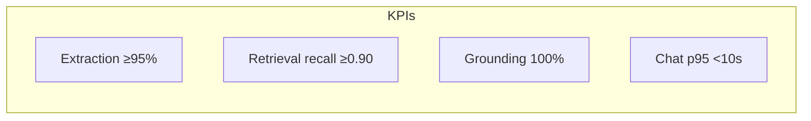
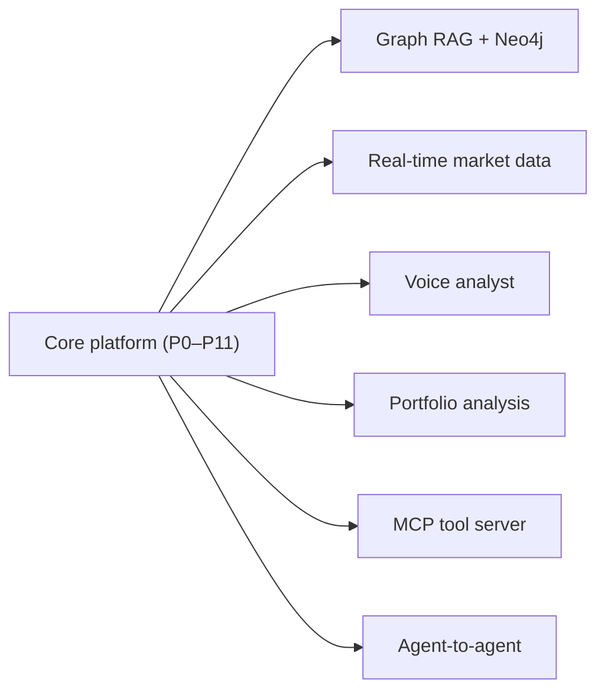

# 06 — Implementation Roadmap

> **Document status:** LIVING DOCUMENT — update continuously
> **Last updated:** 2026-06-10
> **Role:** Engineering diary · execution blueprint · architectural decision record (ADR)
> **Audience:** Everyone — engineers, evaluators, professors, hackathon judges, future maintainers

> ⚠️ **This is the most important document in the project.** It is updated at the end of every working session: new ADRs, implementation-log entries, risks discovered, lessons learned, and metric snapshots. Treat it as the source of truth for *why* the system is the way it is.

---

## Table of Contents

1. [Project Vision](#1-project-vision)
2. [Phase Breakdown](#2-phase-breakdown)
   - ⭐ [Phase 0 Completion Report](#phase-0-completion-report)
   - ⭐ [Phase 0.5 — Repository Foundation](#phase-05--repository-foundation)
   - ⭐ [Phase 1A — Document Ingestion Foundation](#phase-1a--document-ingestion-foundation)
3. [Technology Decisions Log](#3-technology-decisions-log)
4. [Architecture Decision Records (ADR)](#4-architecture-decision-records-adr)
5. [Implementation Log](#5-implementation-log)
6. [Risks and Challenges](#6-risks-and-challenges)
7. [Lessons Learned](#7-lessons-learned)
8. [Metrics Dashboard](#8-metrics-dashboard)
9. [Future Enhancements](#9-future-enhancements)

---

## 1. Project Vision

### What we are building
A production-grade **RAG + multi-agent** platform that analyzes financial disclosures (10-K, 10-Q, earnings call transcripts) and automates analyst work: metric extraction, YoY/QoQ comparison, risk extraction and evolution tracking, management tone analysis, competitor benchmarking, investment memo generation, and grounded conversational Q&A.

### Why we are building it
Financial analysis is document-heavy, repetitive, and error-prone. Generic LLM chatbots hallucinate numbers and can't cite sources — fatal in finance. We build a system where **every claim is grounded in a citable source**, structured data is computed **deterministically**, and specialist agents reason like a disciplined analyst. The result: minutes-not-hours to first insight, with full auditability.

### Success criteria

| Dimension | Target |
|---|---|
| Time to queryable | < 5 min from upload to READY |
| Metric extraction accuracy | ≥ 95% on a labeled gold set |
| Grounding | 100% of financial claims carry a citation; 0 fabricated numbers |
| Risk evolution | Correctly classify NEW/REMOVED/MODIFIED across periods |
| Answer quality | Grounded, cited, or explicit "insufficient evidence" |
| Memo quality | Analyst-acceptable structured memo with justified recommendation |
| Infra simplicity | Single primary datastore (Postgres + pgvector) |
| Cost | Gemini-first; bounded fallback spend per request |

---

## 2. Phase Breakdown

| Phase | Name | Goal | Key deliverables | Exit criteria |
|---|---|---|---|---|
| **0** | **Architecture** | Foundation & docs | `docs/01–06`, schema, decisions locked | All 6 docs reviewed; tech stack ratified |
| **0.5** | **Repository Foundation** | Scaffold & infra | Monorepo structure, Docker stack, config/logging/health, Celery + Alembic + SQLAlchemy patterns, `docs/07–09` | Stack boots; health endpoints green (see §below) |
| **1A** | **Document Ingestion** ✅ | Upload + raw PDF extraction | Upload/store/queue, PyMuPDF parser, `companies`/`reports`/`report_pages`, report APIs | PDF→pages persisted; status tracked (DONE) |
| **1B** | **Document Intelligence** | Section detection | Sectioner (10-K/10-Q item map), transcript segmentation, table handling | Sections correctly identified |
| **2** | **Knowledge Base** | Chunk + embed + store | Chunker, Gemini embedding pipeline, pgvector + HNSW, `/upload`,`/search` | Semantic search returns relevant cited chunks |
| **3** | **Financial Metric Extraction** | Typed KPIs + deltas | Metric Extraction Agent, `financial_metrics`, YoY/QoQ, `/metrics` | ≥95% extraction accuracy on gold set |
| **4** | **Risk Intelligence** | Risks + evolution | Risk Analysis Agent, `risk_factors`, diff engine, `/risks` | Correct NEW/REMOVED/MODIFIED labeling |
| **5** | **Management Tone Analysis** | Sentiment/confidence | Tone Agent, `tone_analysis`, rubric scoring, trends | Stable, rubric-anchored scores with citations |
| **6** | **Advanced RAG** | Precision retrieval | Query rewrite, HyDE, **BGE re-ranking (`BAAI/bge-reranker-base`)**, metadata filtering, groundedness guard | Measurable retrieval-accuracy lift |
| **7** | **Multi-Agent Orchestration** | LangGraph supervisor | Supervisor + graph, checkpointing, shared state | Parallel ingestion + conditional query routing working |
| **8** | **Competitor Benchmarking** | Peer comparison | Benchmark Agent, metric alignment, `/benchmark`, caching | Correct cross-company normalized comparison |
| **9** | **Investment Memo Generation** | Synthesis | Memo Agent, `investment_memos`, `/memos`, export | Cited, structured memo with recommendation |
| **10** | **Conversational Financial Analyst** | Chat | Streaming `/chat`, session context, citations UI | Grounded multi-turn Q&A with click-through |
| **11** | **Production Hardening** | Reliability & scale | AuthN/Z, rate limits, observability, fallback, HITL review, load test | SLOs met; security review passed |
| **12** | **Bonus Features & MCP** | Extensibility | MCP tool server, selected future enhancements | External agents can call analyst tools |

```mermaid
flowchart LR
    P0["P0 Architecture"] --> P05["P0.5 Repo Foundation"] --> P1["P1 Doc Intelligence"] --> P2["P2 Knowledge Base"]
    P2 --> P3["P3 Metrics"] --> P4["P4 Risk"] --> P5["P5 Tone"]
    P5 --> P6["P6 Advanced RAG"] --> P7["P7 Multi-Agent"]
    P7 --> P8["P8 Benchmark"] --> P9["P9 Memo"] --> P10["P10 Chat"]
    P10 --> P11["P11 Hardening"] --> P12["P12 MCP / Bonus"]
```

> **Dependency notes:** P2 depends on P1 (clean parses). P3–P5 depend on P2 (chunks to extract from). P7 (LangGraph) formalizes orchestration that P3–P5 prototype. P9 (memo) depends on P3/P4/P5/P8. P10 depends on P6. P11 spans everything.

---

## Phase 0 Completion Report

> **Date closed:** 2026-06-10 · **Owner:** Principal Architect (nickg) · **Status:** ✅ **APPROVED FOR IMPLEMENTATION**

### Objectives Achieved

| Objective | Deliverable | Status |
|---|---|---|
| Architecture Design | `docs/01_ARCHITECTURE.md` | ✅ Complete |
| Database Design | `docs/02_DATABASE_DESIGN.md` | ✅ Complete |
| Agent Design | `docs/03_AGENT_DESIGN.md` | ✅ Complete |
| API Design | `docs/04_API_DESIGN.md` | ✅ Complete |
| Retrieval Design | `docs/05_RETRIEVAL_DESIGN.md` | ✅ Complete |
| Implementation Roadmap | `docs/06_IMPLEMENTATION_ROADMAP.md` | ✅ Complete |

### Key Decisions Ratified

| ADR | Decision |
|---|---|
| **ADR-001** | Use FastAPI |
| **ADR-002** | Use PostgreSQL + pgvector |
| **ADR-003** | Use Gemini Embeddings |
| **ADR-004** | Use LangGraph |
| **ADR-005** | Use Hybrid Retrieval |
| **ADR-006** | Use Multi-Agent Architecture |
| **ADR-007** | Store Financial Intelligence Separately From RAG Chunks (deterministic numbers principle) |
| **ADR-008** | Use Redis + Celery for Asynchronous Processing |

> Two further ADRs were recorded during finalization and are also ratified: **ADR-009** (LLM provider gateway with primary→fallback — renumbered from the original draft's ADR-008) and **ADR-010** (`BAAI/bge-reranker-base` as the primary re-ranker).

### Major Risks Identified

| Risk | Mitigation summary |
|---|---|
| **Document processing complexity** | Async Redis + Celery pipeline (ADR-008), staged tasks, retries, progress streaming |
| **Financial table extraction** | Table-aware parsing, tables-as-units chunking, confidence scoring, gold-set eval, human review |
| **Retrieval quality** | Hybrid retrieval (ADR-005) + BGE re-ranking (ADR-010) + metadata filtering |
| **Hallucination prevention** | Grounding mandate, citation requirement, groundedness guard, deterministic numbers (ADR-007) |

### Open Decisions Deferred

| Deferred decision | Resolve in | Why deferred |
|---|---|---|
| **Embedding dimension (`EMBEDDING_DIM`)** | Phase 2 | Fixed only once the embedding model is selected and benchmarked; avoids premature schema lock-in (see `02_DATABASE_DESIGN.md` §6.1) |
| **Specific Gemini embedding variant** | Phase 2 | Quality/cost/latency trade-off must be tested against our own corpus |
| **Production deployment provider** | Phase 11 | Not on the critical path for build-out; abstracted behind containers + managed services |

### Exit Criteria Status

| Exit criterion | Status |
|---|---|
| All six Phase 0 documents authored and reviewed | ✅ Complete |
| Technology stack ratified | ✅ Complete |
| All architectural decisions logged as ADRs | ✅ Complete |
| No unresolved contradictions across documents | ✅ Complete |
| Deferred decisions explicitly documented with resolution phase | ✅ Complete |

### Result

> **Phase 0 is APPROVED for Implementation.** The project may proceed to repository scaffolding and Phase 1 (Document Intelligence). No blocking ambiguity remains; the only open items are intentionally deferred to the phases where they can be resolved empirically.

---

## Phase 0.5 — Repository Foundation

> **Date:** 2026-06-10 · **Owner:** Platform (nickg) · **Scope:** scaffolding & infrastructure only — **no business logic.**

### What was built

| Area | Deliverable |
|---|---|
| Monorepo | `backend/` · `frontend/` · `infrastructure/` · `docs/` + root `README`, `.gitignore`, `.env.example` |
| Backend skeleton | FastAPI app (`app/main.py`), domain-driven package layout (api/core/db/models/schemas/services/repositories/tasks/agents/retrieval/ingestion/memo/benchmark/utils) |
| Configuration | `core/config.py` — typed, env-based Pydantic settings (local/dev/prod); `EMBEDDING_DIM` left unset (Phase 2) |
| Logging | `core/logging.py` — structlog, JSON or console, request-id binding; shared by API + Celery |
| Health | `/api/v1/health` (liveness), `/ready` (DB+Redis readiness), `/status` (metadata) |
| Database foundation | `db/base.py` (declarative base + naming convention), `db/session.py` (async engine + `get_db`), `models/base.py` (UUID + timestamp mixins) — **patterns only, no domain tables** |
| Async processing | `tasks/celery_app.py` — Celery app, queues (`default`/`ingestion`/`extraction`), routing, retry policy — **no tasks** |
| Migrations | Alembic (`alembic.ini`, `migrations/env.py` → `Base.metadata`, script template, empty `versions/`) |
| Security | `core/security.py` — RBAC roles + auth interface **scaffold** (implemented Phase 11) |
| Docker | `docker-compose.yml` (postgres+pgvector, redis, backend, worker, frontend), backend/frontend Dockerfiles, Postgres `init.sql` (extensions only) |
| Frontend skeleton | Vite + React + TS + Tailwind; folder taxonomy; API client foundation; shell that pings backend `/health` |
| Tests | pytest layout (`unit`/`integration`/`evaluation`), async client fixture, health unit tests |
| Docs | `07_REPOSITORY_STRUCTURE.md`, `08_INFRASTRUCTURE_SETUP.md`, `09_DEVELOPMENT_GUIDELINES.md` |

### Exit Criteria Status

| Exit criterion | Status | Evidence |
|---|---|---|
| Repository structure approved | ✅ | Tree in `07_REPOSITORY_STRUCTURE.md`; matches on disk |
| Docker operational | ✅ | `docker-compose.yml` with 5 services + healthchecks + named volumes |
| PostgreSQL operational | ✅ | `pgvector/pgvector:pg16` + `init.sql` enables `vector`/`pgcrypto`/`pg_trgm` |
| Redis operational | ✅ | `redis:7-alpine`, AOF, logical DBs for broker/result/cache |
| FastAPI boots | ✅ | `app/main.py` (lifespan, CORS, request-id); all modules compile |
| React boots | ✅ | Vite app renders shell, calls `/health` |
| Alembic initialized | ✅ | `alembic.ini` + `migrations/env.py` target `Base.metadata` (baseline empty by design) |
| Health endpoints operational | ✅ | `/health`, `/ready`, `/status` implemented + unit-tested |

> **Note on "boots":** all backend Python modules pass a syntax/compile check, and the
> compose topology, health endpoints, and configuration are in place. A full
> `docker compose up` smoke test should be run on a Docker-enabled host to confirm
> live readiness (the criteria above are structurally satisfied).

### Guardrails honored
No PDF parsing, chunking, embeddings, agents, retrieval, or auth logic was
implemented — only stable interfaces and infrastructure. Deferred items
(`EMBEDDING_DIM`, embedding variant, deploy provider) remain deferred.

### Result
> **Phase 0.5 COMPLETE — foundation ready for Phase 1 (Document Intelligence).**

---

## Phase 1A — Document Ingestion Foundation

> **Date:** 2026-06-10 · **Owner:** Backend (nickg) · **Scope:** upload → store → record → queue → PDF extraction → page persistence. Detailed report: `docs/10_PHASE_1A_IMPLEMENTATION.md`.

### Implementation summary
A user uploads a financial PDF; the API validates (extension/MIME/size/magic
bytes), stores it under a UUID name, creates a `reports` record (status
`UPLOADED`), and enqueues a Celery task. The worker parses the PDF with **PyMuPDF**,
persists one `report_pages` row per page, and moves the report through
`PROCESSING → PROCESSED` (or `FAILED` with a recorded reason). Four endpoints
expose upload, list, detail, and page-text inspection.

### Architecture changes
- **New tables:** `companies`, `reports`, `report_pages` (migration `0001_phase1a`,
  the schema baseline). Enums as `VARCHAR + CHECK`. **No pgvector column** (Phase 2).
- **New modules:** `models/{enums,company,report,report_page}.py`,
  `schemas/report.py`, `repositories/report_repository.py` (async + sync),
  `ingestion/{storage,pdf_parser,validation}.py`,
  `ingestion/services/report_ingestion_service.py`, `tasks/ingestion.py`,
  `api/v1/endpoints/reports.py`, `core/exceptions.py`.
- **Infra wiring:** sync engine/session added for the Celery worker; `process_report`
  registered and routed to the `ingestion` queue; domain-error → HTTP envelope handler.

### Technical decisions
- **PyMuPDF** for extraction (TDL-011): fast, accurate text + metadata, permissive
  to operate. Alternatives (pdfplumber/unstructured/pypdf) deferred/declined for 1A.
- **Sync worker, async API:** dedicated sync SQLAlchemy session for Celery avoids
  async-engine/event-loop pitfalls; the request path stays fully async.
- **Failure = recorded outcome, not crash-loop:** corrupt PDFs are deterministic, so
  the task marks `FAILED` and returns instead of retrying endlessly.
- **Never trust filenames:** UUID storage names + magic-byte (`%PDF-`) validation.

### Lessons learned
- Separating sync/async data access early kept the worker clean (no SQL in the task).
- Validate at the boundary, defend at the DB (CHECK constraints) — layered safety.
- Store provenance (relative `storage_path`), not the bytes, in the DB.

### Exit criteria
All 10 Phase 1A exit criteria met (PDF upload, record, storage, task, extraction,
page persistence, status updates, correct APIs, tests, docs). **19 unit tests pass;**
integration suite (DB-backed) authored for CI. Full table in `docs/10`.

### Result
> **Phase 1A COMPLETE.** Phase 1B (section detection / normalization) NOT started — out of scope.

---

## 3. Technology Decisions Log

> Template: **Decision · Alternatives Considered · Chosen Because · Tradeoffs · Expected Impact**

### TDL-001 — Backend framework
- **Decision:** FastAPI
- **Alternatives:** Django REST, Flask, Node/Express
- **Chosen because:** strongest Python AI ecosystem, native async, first-class Pydantic validation, clean OpenAPI, LangGraph compatibility
- **Tradeoffs:** smaller batteries-included surface than Django (auth/admin assembled manually)
- **Expected impact:** fast iteration, great fit with the AI tooling we depend on

### TDL-002 — Database + Vector store
- **Decision:** PostgreSQL + pgvector
- **Alternatives:** Pinecone, ChromaDB, Qdrant, Weaviate
- **Chosen because:** unified relational + vector storage, mature metadata filtering, one system to operate/back up, transactional consistency between chunks and structured data
- **Tradeoffs:** less specialized than dedicated vector DBs at very large scale; HNSW tuning is on us
- **Expected impact:** dramatically simpler infra and deployment; easier hybrid retrieval

### TDL-003 — Embedding model
- **Decision:** Gemini Embeddings
- **Alternatives:** OpenAI text-embedding-3, Cohere embed, open-source (BGE, E5)
- **Chosen because:** cost-effective, high-quality semantic retrieval, consistent with Gemini-first stack
- **Tradeoffs:** external dependency; model change forces re-embed migration
- **Expected impact:** good retrieval quality at low cost

### TDL-004 — Primary LLM
- **Decision:** Gemini 2.5 Pro
- **Alternatives:** GPT-4o, Claude, open-weights
- **Chosen because:** excellent reasoning, strong long-context (whole-filing reasoning), cost efficiency
- **Tradeoffs:** provider lock-in mitigated by the gateway abstraction
- **Expected impact:** high-quality extraction/synthesis within budget

### TDL-005 — Fallback LLM
- **Decision:** GPT-4o via OpenRouter
- **Alternatives:** direct OpenAI, Claude via Anthropic, Azure OpenAI
- **Chosen because:** independent provider for failover + output validation/comparison; OpenRouter simplifies access
- **Tradeoffs:** extra hop; per-token cost on fallback path
- **Expected impact:** resilience and a second opinion on high-stakes outputs

### TDL-006 — Agent framework
- **Decision:** LangGraph
- **Alternatives:** plain LangChain chains, CrewAI, AutoGen, bespoke orchestration
- **Chosen because:** stateful graphs, checkpointing, parallel + conditional routing, replayable/auditable runs
- **Tradeoffs:** learning curve; younger ecosystem
- **Expected impact:** robust, debuggable multi-agent workflows

### TDL-007 — Retrieval strategy
- **Decision:** Hybrid (metadata filter + vector + query rewrite + re-rank)
- **Alternatives:** pure vector, pure keyword/BM25
- **Chosen because:** finance is partitioned by company/period; pre-filtering guarantees correct scope, vector finds the passage, re-ranking lifts precision
- **Tradeoffs:** more moving parts than naive vector search
- **Expected impact:** higher precision, fewer wrong-document answers

### TDL-008 — Frontend stack
- **Decision:** React + TypeScript + TailwindCSS + ShadCN
- **Alternatives:** Vue, SvelteKit, plain CSS / MUI
- **Chosen because:** modern, dashboard-friendly, rapid component development, strong typing
- **Tradeoffs:** SPA build/ops overhead
- **Expected impact:** fast UI delivery, good DX

### TDL-009 — Asynchronous job processing
- **Decision:** Redis + Celery
- **Alternatives:** FastAPI BackgroundTasks, RQ, Dramatiq
- **Chosen because:** mature ecosystem, retries, monitoring (Flower), long-running job support, independent worker scaling, production readiness
- **Tradeoffs:** extra infrastructure (Redis instance + worker fleet) to operate
- **Expected impact:** reliable, scalable ingestion pipeline fully decoupled from the API (see ADR-008)

### TDL-010 — Re-ranking model
- **Decision:** `BAAI/bge-reranker-base` (local cross-encoder) as primary
- **Alternatives:** LLM-based re-ranking, hosted re-ranker API (Cohere Rerank)
- **Chosen because:** strong performance, fast, cheap, deterministic, runs locally on the critical path
- **Tradeoffs:** local model dependency; LLM re-ranking kept only as an offline eval layer
- **Expected impact:** higher retrieval precision with bounded latency and reproducible results (see ADR-010)

### TDL-011 — PDF extraction library (Phase 1A)
- **Decision:** PyMuPDF (`pymupdf`, imported as `fitz`)
- **Alternatives:** pdfplumber, pypdf, unstructured
- **Chosen because:** fast C-backed extraction, reliable per-page text + document metadata, simple API, good layout fidelity for financial filings
- **Tradeoffs:** AGPL/commercial licensing to track; no OCR (image-only PDFs unsupported in 1A)
- **Expected impact:** robust raw-text foundation for chunking/structure in later phases

---

## 4. Architecture Decision Records (ADR)

> Each ADR: **Context · Problem · Options · Decision · Consequences**. Status: Accepted unless noted.

### ADR-001 — Use FastAPI  *(Accepted)*
- **Context:** Need an async, Python-native API layer that plays well with the AI ecosystem.
- **Problem:** Choose a backend framework balancing speed, validation, and AI-library fit.
- **Options:** FastAPI · Django REST · Flask · Node/Express.
- **Decision:** FastAPI.
- **Consequences:** Native async + Pydantic + OpenAPI; we assemble auth/admin ourselves. (See TDL-001.)

### ADR-002 — Use PostgreSQL + pgvector  *(Accepted)*
- **Context:** We need both relational financial data and vector search.
- **Problem:** One unified store vs separate relational DB + dedicated vector DB.
- **Options:** Postgres+pgvector · Postgres + Pinecone · Postgres + Qdrant/Chroma.
- **Decision:** Postgres + pgvector.
- **Consequences:** One system to run/back up; transactional consistency; hybrid retrieval via SQL. Must tune HNSW and own scaling. (See TDL-002.)

### ADR-003 — Use Gemini Embeddings  *(Accepted)*
- **Context:** Need cost-effective, high-quality embeddings.
- **Problem:** Which embedding provider/model.
- **Options:** Gemini · OpenAI · Cohere · open-source.
- **Decision:** Gemini Embeddings.
- **Consequences:** Good quality/cost; the embedding dimension fixes the `vector(EMBEDDING_DIM)` column — and **`EMBEDDING_DIM` is intentionally deferred to Phase 2** (TBD) until the exact Gemini variant is benchmarked; a later model change is a re-embed migration. (See TDL-003 and `02_DATABASE_DESIGN.md` §6.1.)

### ADR-004 — Use LangGraph  *(Accepted)*
- **Context:** Multi-agent workflows must be stateful, resumable, and auditable.
- **Problem:** How to orchestrate specialist agents reliably.
- **Options:** LangGraph · LangChain chains · CrewAI · AutoGen · custom.
- **Decision:** LangGraph.
- **Consequences:** Checkpointing, parallel/conditional graphs, replayable traces; learning curve. (See TDL-006.)

### ADR-005 — Use Hybrid Retrieval  *(Accepted)*
- **Context:** Corpus is partitioned by company/period; wrong-document answers are unacceptable.
- **Problem:** How to retrieve precisely.
- **Options:** Pure vector · BM25 · Hybrid (metadata filter + vector + rewrite + re-rank).
- **Decision:** Hybrid.
- **Consequences:** Higher precision and correct scoping; more components to maintain. (See TDL-007.)

### ADR-006 — Use Multi-Agent Architecture  *(Accepted)*
- **Context:** Analysis spans distinct skills (metrics, risk, tone, benchmark, memo).
- **Problem:** One monolithic prompt vs specialist agents.
- **Options:** Single mega-agent · Supervisor + specialists.
- **Decision:** Supervisor + single-responsibility specialists communicating via shared state.
- **Consequences:** Decoupled, testable, parallelizable; requires orchestration (LangGraph) and shared-state discipline. (See `03_AGENT_DESIGN.md`.)

### ADR-007 — Store Financial Intelligence Separately From RAG Chunks  *(Accepted — expanded at Phase 0 closure)*
- **Context:** Numbers must be aggregated, compared, ranked, and verified **exactly**. Generative text is the wrong substrate for arithmetic.
- **Problem:** Keep extracted financial intelligence only as vector chunks vs also as typed relational rows.
- **Options:** Vector-only · Typed structured tables linked to source chunks.
- **Decision:** The structured-intelligence tables — **`financial_metrics`, `risk_factors`, `tone_analysis`, and `benchmark_results`** — are kept **strictly separate** from `document_chunks`, each row linked back to a `source_chunk_id` for citation.
- **Governing principle:** **"Numbers are computed deterministically, not generated by the LLM."** The LLM's role is *language understanding* — locate and read the right value/risk/sentiment and return the exact source span. All quantitative operations — **growth (YoY/QoQ), ratios, rankings, percentiles, benchmarking, and aggregations** — are performed by deterministic SQL/Python over the typed rows, never by the model.
- **Why not derive these from generated text:**
  - **Arithmetic hallucination** — LLMs silently miscompute deltas and ratios; in finance that is disqualifying.
  - **Non-reproducibility** — text generation is temperature- and context-window-dependent; the same question could yield different numbers.
  - **Terminology drift** — cross-company comparison needs canonical `metric_key` + normalized units/periods, not free-text matching ("net sales" vs "revenue").
  - **Auditability** — a stored `numeric` + a cited `source_chunk_id` is re-derivable and inspectable; a sentence is not.
- **Consequences:** Deterministic, exact, auditable arithmetic via SQL; zero LLM math on the result path; cheap SQL-based dashboards/benchmarks instead of repeated LLM calls; a small, accepted text/row duplication. **This separation is the cornerstone of hallucination prevention.** (See `02_DATABASE_DESIGN.md` §1.1.)

### ADR-008 — Use Redis + Celery for Asynchronous Processing  *(Accepted)*
- **Context:** Financial documents can run to hundreds of pages and require parsing, chunking, embedding generation, metric extraction, risk analysis, and tone analysis. These tasks are far too expensive and long-running for synchronous request handling.
- **Problem:** How to execute heavy, multi-stage document processing reliably and at scale without blocking HTTP requests.
- **Options:**
  1. **FastAPI `BackgroundTasks`** — in-process; dies with the worker, no retries, no monitoring, no horizontal scaling.
  2. **RQ** — simple, but thinner retry/monitoring/routing story.
  3. **Dramatiq** — capable, smaller ecosystem and community.
  4. **Redis + Celery** — mature, battle-tested distributed task queue.
- **Decision:** **Redis + Celery.** Redis is the broker (and result backend/cache); Celery runs the processing pipeline as tasks on autoscaled workers.
- **Reasoning:** mature ecosystem, first-class **retry** support, rich **monitoring** (e.g. Flower), robust **long-running job** handling, independent **worker scaling**, and proven **production readiness**.
- **Consequences:**
  - **Pros:** reliable ingestion pipeline; scalable processing decoupled from the API; retries with backoff; observability into queue depth and task state.
  - **Cons:** additional infrastructure to run and operate (a Redis instance + worker fleet). Accepted as a necessary cost of production-grade async processing.
  - (See `01_ARCHITECTURE.md` deployment section and `04_API_DESIGN.md` async boundary; TDL-009.)

### ADR-009 — Provider gateway with primary→fallback  *(Accepted — renumbered from ADR-008 at Phase 0 closure)*
- **Context:** Single-provider dependency is a reliability and validation risk.
- **Problem:** How to add resilience and a second opinion.
- **Options:** Single provider · Gateway abstraction with Gemini primary + GPT-4o fallback.
- **Decision:** LLM gateway; Gemini primary, GPT-4o (OpenRouter) fallback/validator; record `model_used` + cost.
- **Consequences:** Resilience + cross-validation; extra abstraction and fallback cost. (See TDL-004/005.)
- **Note:** This ADR was authored as ADR-008 in the original Phase 0 draft and renumbered to **ADR-009** during finalization so that **ADR-008** could carry the formally-ratified Redis + Celery decision.

### ADR-010 — Use `BAAI/bge-reranker-base` as the Primary Re-ranker  *(Accepted)*
- **Context:** Hybrid retrieval over-fetches candidates; we need a precise, fast, reproducible re-ranking step on the critical path (Phase 6).
- **Problem:** Choose the production re-ranker that maximizes relevance without wrecking latency, cost, or reproducibility.
- **Options:** `BAAI/bge-reranker-base` (local cross-encoder) · LLM-based re-ranking · hosted re-ranker API (e.g. Cohere Rerank).
- **Decision:** **`BAAI/bge-reranker-base`** as the primary re-ranker. Pipeline: **Hybrid Retrieval → Top 20 → BGE → Top 5 → Context Assembly → LLM.**
- **Reasoning:** strong passage-re-ranking performance, **fast** (sub-100ms batch over 20 candidates), **cheap** (no per-call token cost), **deterministic** (reproducible scores → testable retrieval), and **runs locally** (no network hop, no data egress, no rate limits on the hot path).
- **Consequences:** LLM-based re-ranking is **excluded from the critical retrieval path** (slow, costly, non-deterministic) and reserved only as an *offline evaluation/audit layer*. Adds a local model dependency (one-time download, modest memory). (See `05_RETRIEVAL_DESIGN.md` §8.)

---

## 5. Implementation Log

> Append-only. Format: **Date · Phase · Feature · Developer · Description · Status**

| Date | Phase | Feature | Developer | Description | Status |
|---|---|---|---|---|---|
| 2026-06-10 | 0 | Documentation suite | nickg | Authored `docs/01–06`: architecture, DB design, agent design, API design, retrieval design, roadmap | ✅ Completed |
| 2026-06-10 | 0 | Tech stack ratified | nickg | Locked FastAPI / React / Postgres+pgvector / Gemini / LangGraph / hybrid retrieval | ✅ Completed |
| 2026-06-10 | 0 | Schema v1 designed | nickg | DDL for 9 tables + HNSW/GIN indexes + ADR-007 separation | ✅ Completed |
| 2026-06-10 | 0 | Phase 0 finalization review | nickg | Ratified ADR-008 (Redis+Celery), ADR-010 (BGE reranker); renumbered provider gateway → ADR-009; deferred `EMBEDDING_DIM`=TBD to Phase 2; expanded ADR-007 determinism principle; authored Phase 0 Completion Report | ✅ Completed |
| 2026-06-10 | 0 | **Phase 0 CLOSED** | nickg | All exit criteria met; approved for implementation | ✅ Completed |
| 2026-06-10 | 0.5 | Repository & infra scaffold | nickg | Monorepo, Docker stack (postgres+pgvector/redis/backend/worker/frontend), config/logging/health, SQLAlchemy + Alembic + Celery patterns, security scaffold, frontend skeleton, tests | ✅ Completed |
| 2026-06-10 | 0.5 | Foundation docs | nickg | Authored `docs/07_REPOSITORY_STRUCTURE.md`, `08_INFRASTRUCTURE_SETUP.md`, `09_DEVELOPMENT_GUIDELINES.md`; added Phase 0.5 to roadmap | ✅ Completed |
| 2026-06-10 | 0.5 | **Phase 0.5 COMPLETE** | nickg | All exit criteria met; foundation ready for Phase 1 | ✅ Completed |
| 2026-06-10 | 1A | Ingestion schema | nickg | `companies`/`reports`/`report_pages` models + migration `0001_phase1a` (baseline) | ✅ Completed |
| 2026-06-10 | 1A | PDF extraction engine | nickg | PyMuPDF parser (`ingestion/pdf_parser.py`): page text + metadata | ✅ Completed |
| 2026-06-10 | 1A | Storage + validation | nickg | UUID-named local storage (YYYY/MM); ext/MIME/size/magic-byte validation | ✅ Completed |
| 2026-06-10 | 1A | Ingestion service + task | nickg | `ReportIngestionService` + `process_report` Celery task (sync worker) | ✅ Completed |
| 2026-06-10 | 1A | Report APIs | nickg | upload / list / detail / pages under `/api/v1/reports` | ✅ Completed |
| 2026-06-10 | 1A | Tests + docs | nickg | 19 unit tests pass; integration suite authored; `docs/10` | ✅ Completed |
| 2026-06-10 | 1A | **Phase 1A COMPLETE** | nickg | All exit criteria met; 1B not started | ✅ Completed |
| | 1B | Section detection / sectioner | | 10-K/10-Q item map; transcript segmentation | ⬜ Todo |

> _Add a row per meaningful change. Mark status: ⬜ Todo · 🟡 In progress · ✅ Completed · ⛔ Blocked._

---

## 6. Risks and Challenges

> Format: **Risk · Impact · Likelihood · Mitigation · Owner/Status**

| Risk | Impact | Likelihood | Mitigation |
|---|---|---|---|
| **Financial table extraction failures** | High — wrong/missing KPIs | Medium | Table-aware parsing; tables-as-units chunking; confidence scoring; gold-set eval; human review for low confidence |
| **Large PDF processing delays** | Medium — slow time-to-ready | Medium | Async Celery workers (Redis broker, ADR-008), batched embedding, queue-depth autoscaling, progress streaming |
| **LLM hallucinations** | Critical — fabricated numbers | Medium | Grounding mandate, citation requirement, groundedness guard, deterministic math, refusal path |
| **Incorrect metric extraction** | High — bad analysis | Medium | Structured output + schema validation, confidence thresholds, fallback-model cross-check, gold-set accuracy ≥95% gate |
| **Embedding model change** | Medium — full re-embed | Low | Version metadata; treat as migration; rebuild HNSW |
| **Provider outage / rate limits** | Medium — downtime | Medium | Gateway with GPT-4o fallback; retries w/ backoff; per-request budget |
| **Wrong-document retrieval** | High — answers about wrong period/company | Medium | Mandatory metadata pre-filter; re-ranking; period/section tie-breakers |
| **Cost overrun (LLM spend)** | Medium | Medium | Gemini-first, embedding batching, retrieval caching, bounded retries, per-doc/query budgets, token accounting |
| **Cross-company metric mismatch** | Medium — bad benchmarks | Medium | Canonical `metric_key` mapping; LLM only for name disambiguation; unit/period normalization |
| **Scanned/image-only PDFs** | Medium — no text | Low | OCR pre-step; flag unsupported documents |
| **Risk-evolution mislabeling** | Medium | Medium | Semantic alignment + prior-period links; rubric; cite both periods |

---

## 7. Lessons Learned

> Living section — append as the project teaches us things. Format encouraged: *what happened → what we changed → impact.*

- **(Phase 0) Separate structured data early (ADR-007).** Designing `financial_metrics` as typed rows from day one — rather than retrofitting onto vector chunks — is what makes deterministic, auditable arithmetic possible. Establishing this in Phase 0 avoids a painful later refactor.
- **(Phase 0) Metadata is part of the chunk, not an afterthought.** Denormalizing `ticker`/`period`/`section` into chunk metadata enables fast hybrid pre-filtering; deciding the metadata schema before embedding avoids a re-embed.
- _Subsections to maintain going forward:_ **Mistakes made · Refactoring decisions · Performance improvements · Retrieval improvements.**

| Sub-area | Entry | Date |
|---|---|---|
| Mistakes made | _(none yet)_ | |
| Refactoring decisions | (1A) Added a dedicated **sync** engine/session for Celery rather than driving the async engine inside tasks — avoids event-loop lifecycle bugs. | 2026-06-10 |
| Performance improvements | _(none yet)_ | |
| Retrieval improvements | _(none yet)_ | |
| Robustness (1A) | Magic-byte (`%PDF-`) check beyond extension/MIME; idempotent `replace_pages` so re-processing is safe; failures recorded as `FAILED` not crash-loops. | 2026-06-10 |

---

## 8. Metrics Dashboard

> Snapshot project health each phase. Update the "Current" column as features land.

| Metric | Definition | Target | Current |
|---|---|---|---|
| Documents processed | Count of PROCESSED reports | — | 0 (ingestion pipeline live as of 1A) |
| Retrieval accuracy | Relevant-chunk hit rate on eval set (recall@k) | ≥ 0.90 | n/a |
| Extraction accuracy | Correct metrics vs gold labels | ≥ 0.95 | n/a |
| Risk detection accuracy | Correct risk + change_type vs labels | ≥ 0.90 | n/a |
| Tone score stability | Variance across reruns (lower better) | low | n/a |
| Response latency (chat, p50/p95) | End-to-end answer time | < 4s / < 10s | n/a |
| Ingestion time (per 100 pages) | Upload → READY | < 5 min | n/a |
| Benchmark accuracy | Correct normalized peer comparison | ≥ 0.95 | n/a |
| Grounding rate | % financial claims with valid citation | 100% | n/a |
| LLM cost / document | Avg spend to fully process a filing | budgeted | n/a |

---

## 9. Future Enhancements

| Idea | Description | Value | Phase |
|---|---|---|---|
| **Graph RAG** | Model entities/periods/relationships as a graph for multi-hop reasoning | Cross-filing, cross-company reasoning | Future |
| **Neo4j integration** | Knowledge graph store for the above | Relationship queries at scale | Future |
| **Voice-based analyst** | STT/TTS conversational front-end | Hands-free analysis | Future |
| **Real-time market data** | Join filings with live prices/consensus/news | Timely, market-aware insight | Future / P12 |
| **Portfolio analysis** | Roll up analysis across a watchlist | Portfolio-level risk/exposure | Future |
| **Agent-to-agent communication** | Collaborate with external specialist agents | Extensible analysis network | Future |
| **MCP tool server** | Expose extraction/benchmark/memo as MCP tools | Other agents can call our platform | P12 |

---

### How to maintain this document
1. **End of every session:** add Implementation-Log row(s); update affected metric "Current" values.
2. **On any architectural choice:** add an ADR (Context · Problem · Options · Decision · Consequences) and, if it's a tooling choice, a TDL entry.
3. **On any surprise/bug/refactor:** add a Lessons-Learned entry (*what happened → what changed → impact*).
4. **On any new risk:** add a Risks row with mitigation + owner.
5. Keep the **Last updated** date current.

> Cross-references: `01_ARCHITECTURE.md` · `02_DATABASE_DESIGN.md` · `03_AGENT_DESIGN.md` · `04_API_DESIGN.md` · `05_RETRIEVAL_DESIGN.md`.
