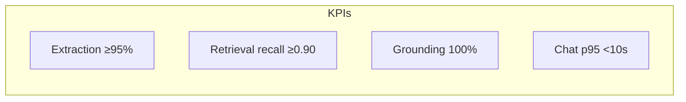
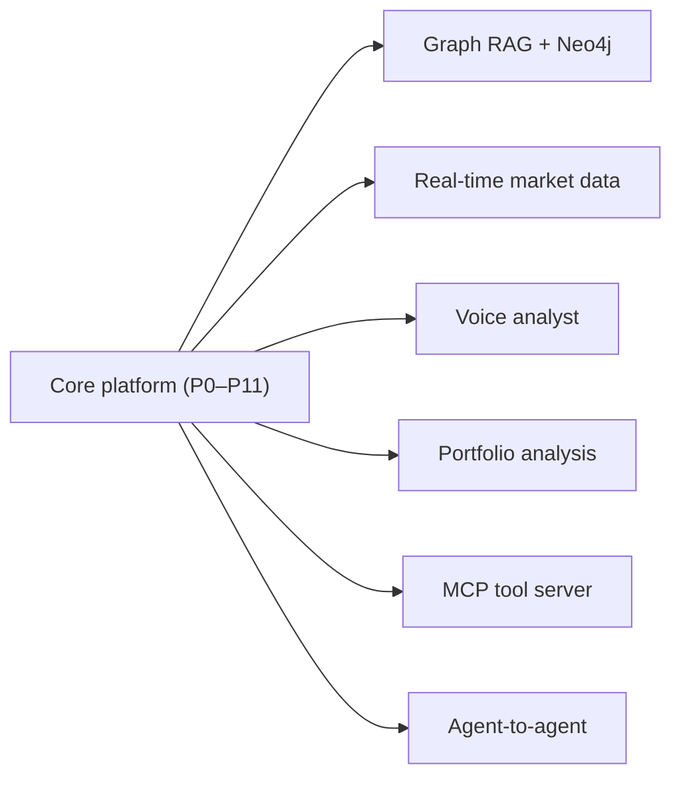

# 06 — Implementation Roadmap

> **Document status:** LIVING DOCUMENT — update continuously
> **Last updated:** 2026-06-11
> **Role:** Engineering diary · execution blueprint · architectural decision record (ADR)
> **Audience:** Everyone — engineers, evaluators, professors, hackathon judges, future maintainers

> ⚠️ **This is the most important document in the project.** It is updated at the end of every working session: new ADRs, implementation-log entries, risks discovered, lessons learned, and metric snapshots. Treat it as the source of truth for *why* the system is the way it is.

---

## Table of Contents

1. [Project Vision](#1-project-vision)
2. [Phase Breakdown](#2-phase-breakdown)
   - ⭐ [Phase 0 Completion Report](#phase-0-completion-report)
   - ⭐ [Phase 0.5 — Repository Foundation](#phase-05--repository-foundation)
   - ⭐ [Phase 1A — Document Ingestion Foundation](#phase-1a--document-ingestion-foundation)
   - ⭐ [Phase 1B Completion Report — Financial Section Intelligence](#phase-1b-completion-report--financial-section-intelligence)
   - ⭐ [Phase 1C Completion Report — Knowledge Preparation Layer](#phase-1c-completion-report--knowledge-preparation-layer)
   - ⭐ [Phase 2A Completion Report — Embedding Infrastructure](#phase-2a-completion-report--embedding-infrastructure)
   - ⭐ [Phase 2B Completion Report — Vector Search Foundation](#phase-2b-completion-report--vector-search-foundation)
   - ⭐ [Phase 2C Completion Report — Hybrid Retrieval Foundation](#phase-2c-completion-report--hybrid-retrieval-foundation)
3. [Technology Decisions Log](#3-technology-decisions-log)
4. [Architecture Decision Records (ADR)](#4-architecture-decision-records-adr)
5. [Implementation Log](#5-implementation-log)
6. [Risks and Challenges](#6-risks-and-challenges)
7. [Lessons Learned](#7-lessons-learned)
8. [Metrics Dashboard](#8-metrics-dashboard)
9. [Future Enhancements](#9-future-enhancements)

---

## 1. Project Vision

### What we are building
A production-grade **RAG + multi-agent** platform that analyzes financial disclosures (10-K, 10-Q, earnings call transcripts) and automates analyst work: metric extraction, YoY/QoQ comparison, risk extraction and evolution tracking, management tone analysis, competitor benchmarking, investment memo generation, and grounded conversational Q&A.

### Why we are building it
Financial analysis is document-heavy, repetitive, and error-prone. Generic LLM chatbots hallucinate numbers and can't cite sources — fatal in finance. We build a system where **every claim is grounded in a citable source**, structured data is computed **deterministically**, and specialist agents reason like a disciplined analyst. The result: minutes-not-hours to first insight, with full auditability.

### Success criteria

| Dimension | Target |
|---|---|
| Time to queryable | < 5 min from upload to READY |
| Metric extraction accuracy | ≥ 95% on a labeled gold set |
| Grounding | 100% of financial claims carry a citation; 0 fabricated numbers |
| Risk evolution | Correctly classify NEW/REMOVED/MODIFIED across periods |
| Answer quality | Grounded, cited, or explicit "insufficient evidence" |
| Memo quality | Analyst-acceptable structured memo with justified recommendation |
| Infra simplicity | Single primary datastore (Postgres + pgvector) |
| Cost | Gemini-first; bounded fallback spend per request |

---

## 2. Phase Breakdown

| Phase | Name | Goal | Key deliverables | Exit criteria |
|---|---|---|---|---|
| **0** | **Architecture** | Foundation & docs | `docs/01–06`, schema, decisions locked | All 6 docs reviewed; tech stack ratified |
| **0.5** | **Repository Foundation** | Scaffold & infra | Monorepo structure, Docker stack, config/logging/health, Celery + Alembic + SQLAlchemy patterns, `docs/07–09` | Stack boots; health endpoints green (see §below) |
| **1A** | **Document Ingestion** ✅ | Upload + raw PDF extraction | Upload/store/queue, PyMuPDF parser, `companies`/`reports`/`report_pages`, report APIs | PDF→pages persisted; status tracked (DONE) |
| **1B** | **Section Intelligence** ✅ | Rule-based section detection | `report_sections`, detection engine + configurable taxonomy, section APIs, status lifecycle | Sections detected/normalized/stored for 10-K/10-Q/transcript (DONE) |
| **1C** | **Knowledge Preparation** ✅ | Section-aware recursive chunking | `document_chunks` (+metadata, no vectors), chunking engine, token counter, validation, chunk APIs | Validated chunks + metadata stored for 10-K/10-Q/transcript (DONE) |
| **2A** | **Embedding Infrastructure** ✅ | Embed + store (no search) | `gemini-embedding-001`→`vector(768)`, provider layer, embedding APIs/status; **no ANN index** | Every chunk has a valid stored embedding (DONE) |
| **2B** | **Vector Search Foundation** ✅ | Index + retrieve (vector-only) | HNSW (cosine) on `vector(768)`, query embedding, top-K KNN, `/search/vector`+`/search/debug` | Top-K semantically relevant chunks returned with scores (DONE) |
| **2C** | **Hybrid Retrieval Foundation** ✅ | Metadata filter + vector | Filter→candidate→vector search, retrieval profiles, `/search/hybrid` | Scoped retrieval beats vector-only (DONE) |
| **2D** | **Advanced Retrieval** | Rewrite + rerank | Query rewrite/HyDE, BGE re-rank, groundedness | Higher-precision cited retrieval |
| **3** | **Financial Metric Extraction** | Typed KPIs + deltas | Metric Extraction Agent, `financial_metrics`, YoY/QoQ, `/metrics` | ≥95% extraction accuracy on gold set |
| **4** | **Risk Intelligence** | Risks + evolution | Risk Analysis Agent, `risk_factors`, diff engine, `/risks` | Correct NEW/REMOVED/MODIFIED labeling |
| **5** | **Management Tone Analysis** | Sentiment/confidence | Tone Agent, `tone_analysis`, rubric scoring, trends | Stable, rubric-anchored scores with citations |
| **6** | **Advanced RAG** | Precision retrieval | Query rewrite, HyDE, **BGE re-ranking (`BAAI/bge-reranker-base`)**, metadata filtering, groundedness guard | Measurable retrieval-accuracy lift |
| **7** | **Multi-Agent Orchestration** | LangGraph supervisor | Supervisor + graph, checkpointing, shared state | Parallel ingestion + conditional query routing working |
| **8** | **Competitor Benchmarking** | Peer comparison | Benchmark Agent, metric alignment, `/benchmark`, caching | Correct cross-company normalized comparison |
| **9** | **Investment Memo Generation** | Synthesis | Memo Agent, `investment_memos`, `/memos`, export | Cited, structured memo with recommendation |
| **10** | **Conversational Financial Analyst** | Chat | Streaming `/chat`, session context, citations UI | Grounded multi-turn Q&A with click-through |
| **11** | **Production Hardening** | Reliability & scale | AuthN/Z, rate limits, observability, fallback, HITL review, load test | SLOs met; security review passed |
| **12** | **Bonus Features & MCP** | Extensibility | MCP tool server, selected future enhancements | External agents can call analyst tools |

```mermaid
flowchart LR
    P0["P0 Architecture"] --> P05["P0.5 Repo Foundation"] --> P1["P1 Doc Intelligence"] --> P2["P2 Knowledge Base"]
    P2 --> P3["P3 Metrics"] --> P4["P4 Risk"] --> P5["P5 Tone"]
    P5 --> P6["P6 Advanced RAG"] --> P7["P7 Multi-Agent"]
    P7 --> P8["P8 Benchmark"] --> P9["P9 Memo"] --> P10["P10 Chat"]
    P10 --> P11["P11 Hardening"] --> P12["P12 MCP / Bonus"]
```

> **Dependency notes:** P2 depends on P1 (clean parses). P3–P5 depend on P2 (chunks to extract from). P7 (LangGraph) formalizes orchestration that P3–P5 prototype. P9 (memo) depends on P3/P4/P5/P8. P10 depends on P6. P11 spans everything.

---

## Phase 0 Completion Report

> **Date closed:** 2026-06-10 · **Owner:** Principal Architect (nickg) · **Status:** ✅ **APPROVED FOR IMPLEMENTATION**

### Objectives Achieved

| Objective | Deliverable | Status |
|---|---|---|
| Architecture Design | `docs/01_ARCHITECTURE.md` | ✅ Complete |
| Database Design | `docs/02_DATABASE_DESIGN.md` | ✅ Complete |
| Agent Design | `docs/03_AGENT_DESIGN.md` | ✅ Complete |
| API Design | `docs/04_API_DESIGN.md` | ✅ Complete |
| Retrieval Design | `docs/05_RETRIEVAL_DESIGN.md` | ✅ Complete |
| Implementation Roadmap | `docs/06_IMPLEMENTATION_ROADMAP.md` | ✅ Complete |

### Key Decisions Ratified

| ADR | Decision |
|---|---|
| **ADR-001** | Use FastAPI |
| **ADR-002** | Use PostgreSQL + pgvector |
| **ADR-003** | Use Gemini Embeddings |
| **ADR-004** | Use LangGraph |
| **ADR-005** | Use Hybrid Retrieval |
| **ADR-006** | Use Multi-Agent Architecture |
| **ADR-007** | Store Financial Intelligence Separately From RAG Chunks (deterministic numbers principle) |
| **ADR-008** | Use Redis + Celery for Asynchronous Processing |

> Two further ADRs were recorded during finalization and are also ratified: **ADR-009** (LLM provider gateway with primary→fallback — renumbered from the original draft's ADR-008) and **ADR-010** (`BAAI/bge-reranker-base` as the primary re-ranker).

### Major Risks Identified

| Risk | Mitigation summary |
|---|---|
| **Document processing complexity** | Async Redis + Celery pipeline (ADR-008), staged tasks, retries, progress streaming |
| **Financial table extraction** | Table-aware parsing, tables-as-units chunking, confidence scoring, gold-set eval, human review |
| **Retrieval quality** | Hybrid retrieval (ADR-005) + BGE re-ranking (ADR-010) + metadata filtering |
| **Hallucination prevention** | Grounding mandate, citation requirement, groundedness guard, deterministic numbers (ADR-007) |

### Open Decisions Deferred

| Deferred decision | Resolve in | Why deferred |
|---|---|---|
| **Embedding dimension (`EMBEDDING_DIM`)** | Phase 2 | Fixed only once the embedding model is selected and benchmarked; avoids premature schema lock-in (see `02_DATABASE_DESIGN.md` §6.1) |
| **Specific Gemini embedding variant** | Phase 2 | Quality/cost/latency trade-off must be tested against our own corpus |
| **Production deployment provider** | Phase 11 | Not on the critical path for build-out; abstracted behind containers + managed services |

> **Update (2026-06-11, Phase 2A):** the first two are now **RESOLVED** — `EMBEDDING_DIM = 768`
> and variant = `gemini-embedding-001`, finalized empirically (ADR-013). Deployment provider
> remains deferred to Phase 11.

### Exit Criteria Status

| Exit criterion | Status |
|---|---|
| All six Phase 0 documents authored and reviewed | ✅ Complete |
| Technology stack ratified | ✅ Complete |
| All architectural decisions logged as ADRs | ✅ Complete |
| No unresolved contradictions across documents | ✅ Complete |
| Deferred decisions explicitly documented with resolution phase | ✅ Complete |

### Result

> **Phase 0 is APPROVED for Implementation.** The project may proceed to repository scaffolding and Phase 1 (Document Intelligence). No blocking ambiguity remains; the only open items are intentionally deferred to the phases where they can be resolved empirically.

---

## Phase 0.5 — Repository Foundation

> **Date:** 2026-06-10 · **Owner:** Platform (nickg) · **Scope:** scaffolding & infrastructure only — **no business logic.**

### What was built

| Area | Deliverable |
|---|---|
| Monorepo | `backend/` · `frontend/` · `infrastructure/` · `docs/` + root `README`, `.gitignore`, `.env.example` |
| Backend skeleton | FastAPI app (`app/main.py`), domain-driven package layout (api/core/db/models/schemas/services/repositories/tasks/agents/retrieval/ingestion/memo/benchmark/utils) |
| Configuration | `core/config.py` — typed, env-based Pydantic settings (local/dev/prod); `EMBEDDING_DIM` left unset (Phase 2) |
| Logging | `core/logging.py` — structlog, JSON or console, request-id binding; shared by API + Celery |
| Health | `/api/v1/health` (liveness), `/ready` (DB+Redis readiness), `/status` (metadata) |
| Database foundation | `db/base.py` (declarative base + naming convention), `db/session.py` (async engine + `get_db`), `models/base.py` (UUID + timestamp mixins) — **patterns only, no domain tables** |
| Async processing | `tasks/celery_app.py` — Celery app, queues (`default`/`ingestion`/`extraction`), routing, retry policy — **no tasks** |
| Migrations | Alembic (`alembic.ini`, `migrations/env.py` → `Base.metadata`, script template, empty `versions/`) |
| Security | `core/security.py` — RBAC roles + auth interface **scaffold** (implemented Phase 11) |
| Docker | `docker-compose.yml` (postgres+pgvector, redis, backend, worker, frontend), backend/frontend Dockerfiles, Postgres `init.sql` (extensions only) |
| Frontend skeleton | Vite + React + TS + Tailwind; folder taxonomy; API client foundation; shell that pings backend `/health` |
| Tests | pytest layout (`unit`/`integration`/`evaluation`), async client fixture, health unit tests |
| Docs | `07_REPOSITORY_STRUCTURE.md`, `08_INFRASTRUCTURE_SETUP.md`, `09_DEVELOPMENT_GUIDELINES.md` |

### Exit Criteria Status

| Exit criterion | Status | Evidence |
|---|---|---|
| Repository structure approved | ✅ | Tree in `07_REPOSITORY_STRUCTURE.md`; matches on disk |
| Docker operational | ✅ | `docker-compose.yml` with 5 services + healthchecks + named volumes |
| PostgreSQL operational | ✅ | `pgvector/pgvector:pg16` + `init.sql` enables `vector`/`pgcrypto`/`pg_trgm` |
| Redis operational | ✅ | `redis:7-alpine`, AOF, logical DBs for broker/result/cache |
| FastAPI boots | ✅ | `app/main.py` (lifespan, CORS, request-id); all modules compile |
| React boots | ✅ | Vite app renders shell, calls `/health` |
| Alembic initialized | ✅ | `alembic.ini` + `migrations/env.py` target `Base.metadata` (baseline empty by design) |
| Health endpoints operational | ✅ | `/health`, `/ready`, `/status` implemented + unit-tested |

> **Note on "boots":** all backend Python modules pass a syntax/compile check, and the
> compose topology, health endpoints, and configuration are in place. A full
> `docker compose up` smoke test should be run on a Docker-enabled host to confirm
> live readiness (the criteria above are structurally satisfied).

### Guardrails honored
No PDF parsing, chunking, embeddings, agents, retrieval, or auth logic was
implemented — only stable interfaces and infrastructure. Deferred items
(`EMBEDDING_DIM`, embedding variant, deploy provider) remain deferred.

### Result
> **Phase 0.5 COMPLETE — foundation ready for Phase 1 (Document Intelligence).**

---

## Phase 1A — Document Ingestion Foundation

> **Date:** 2026-06-10 · **Owner:** Backend (nickg) · **Scope:** upload → store → record → queue → PDF extraction → page persistence. Detailed report: `docs/10_PHASE_1A_IMPLEMENTATION.md`.

### Implementation summary
A user uploads a financial PDF; the API validates (extension/MIME/size/magic
bytes), stores it under a UUID name, creates a `reports` record (status
`UPLOADED`), and enqueues a Celery task. The worker parses the PDF with **PyMuPDF**,
persists one `report_pages` row per page, and moves the report through
`PROCESSING → PROCESSED` (or `FAILED` with a recorded reason). Four endpoints
expose upload, list, detail, and page-text inspection.

### Architecture changes
- **New tables:** `companies`, `reports`, `report_pages` (migration `0001_phase1a`,
  the schema baseline). Enums as `VARCHAR + CHECK`. **No pgvector column** (Phase 2).
- **New modules:** `models/{enums,company,report,report_page}.py`,
  `schemas/report.py`, `repositories/report_repository.py` (async + sync),
  `ingestion/{storage,pdf_parser,validation}.py`,
  `ingestion/services/report_ingestion_service.py`, `tasks/ingestion.py`,
  `api/v1/endpoints/reports.py`, `core/exceptions.py`.
- **Infra wiring:** sync engine/session added for the Celery worker; `process_report`
  registered and routed to the `ingestion` queue; domain-error → HTTP envelope handler.

### Technical decisions
- **PyMuPDF** for extraction (TDL-011): fast, accurate text + metadata, permissive
  to operate. Alternatives (pdfplumber/unstructured/pypdf) deferred/declined for 1A.
- **Sync worker, async API:** dedicated sync SQLAlchemy session for Celery avoids
  async-engine/event-loop pitfalls; the request path stays fully async.
- **Failure = recorded outcome, not crash-loop:** corrupt PDFs are deterministic, so
  the task marks `FAILED` and returns instead of retrying endlessly.
- **Never trust filenames:** UUID storage names + magic-byte (`%PDF-`) validation.

### Lessons learned
- Separating sync/async data access early kept the worker clean (no SQL in the task).
- Validate at the boundary, defend at the DB (CHECK constraints) — layered safety.
- Store provenance (relative `storage_path`), not the bytes, in the DB.

### Exit criteria
All 10 Phase 1A exit criteria met (PDF upload, record, storage, task, extraction,
page persistence, status updates, correct APIs, tests, docs). **19 unit tests pass;**
integration suite (DB-backed) authored for CI. Full table in `docs/10`.

### Result
> **Phase 1A COMPLETE.** Phase 1B (section detection / normalization) NOT started — out of scope.

---

## Phase 1B Completion Report — Financial Section Intelligence

### Overview
Phase 1B converts the raw extracted pages from Phase 1A into **meaningful, logical
financial sections** (Risk Factors, MD&A, Financial Statements, transcript
segments, …) and stores them with page boundaries, full content, and a confidence
score. Detection is **100% rule-based and deterministic — no LLMs, no embeddings,
no chunking, no retrieval** — solving the problem of making document structure
queryable cheaply, fast, and explainably. This is the structural layer later
phases (chunking, metric/risk extraction) build on.

### Features Implemented
- Page analysis + **rule-based section detection** (SEC item headings, transcript
  markers, heading-text matching, TOC skipping, PART-context tracking).
- **Section normalization** to a canonical taxonomy (configurable, external JSON).
- **Confidence scoring** per detected section (tiered).
- **Section storage** in a new `report_sections` table (whole-section content; no chunks).
- **Celery `detect_sections` task** with its own status lifecycle (`SECTIONING`/`SECTIONED`).
- Three **APIs**: list sections, section detail (with content), section-map (boundaries).
- Pipeline chaining: `process_report` → enqueues `detect_sections` on success.

### Architecture Changes
- **New module package** `app/ingestion/section_detection/` — `section_detector.py`
  (engine), `section_patterns.py` (regex/heading primitives), `normalization.py`
  (alias→canonical), `taxonomy.py` (loader) + `taxonomy.json` (configurable data).
  *Why:* isolates deterministic structure detection as a reusable, testable unit
  with policy (taxonomy) separated from mechanism (patterns).
- **New table** `report_sections` (+ migration `0002_phase1b`). *Why:* structured
  document intelligence stored separately from future RAG data (ADR-007).
- **Extended `ReportStatus`** with `SECTIONING`/`SECTIONED` and the CHECK constraint.
  *Why:* the sectioning stage is a distinct, observable pipeline step.
- **New Celery task** `app.tasks.ingestion.detect_sections` (ingestion queue).
- **Repository extensions** (async section reads; sync section writes for the worker).

### Technical Decisions
- **Decision:** Rule-based section detection.
  **Alternatives:** LLM-based detection; fine-tuned classifier.
  **Reason chosen:** deterministic, fast (regex over 100–300 pages), cheap (no API),
  explainable, easy to debug — exactly the Phase 1B mandate. (See **ADR-011**.)
  **Tradeoffs:** less flexible on unusual/foreign layouts than an ML approach;
  relies on heading conventions.
- **Decision:** Configurable external taxonomy (`taxonomy.json` + `SECTION_TAXONOMY_PATH`).
  **Reason:** add/adjust section vocabularies without code changes; no hardcoding in logic.
- **Decision:** Document-type/Part-aware SEC item map.
  **Reason:** Item numbers differ between 10-K and 10-Q and repeat across 10-Q
  Part I/II (e.g. Item 2 = Properties in 10-K but MD&A in 10-Q) — a flat map would mislabel.
- **Decision:** TOC lines are skipped as section starts.
  **Reason:** table-of-contents entries are pointers, not the section body; using them
  would set false boundaries. (TOC→page mapping noted as a future improvement.)
- **Decision:** Fallback "Uncategorized" section when nothing matches.
  **Reason:** downstream phases always have a section to operate on.

### Files Created
- `app/models/report_section.py`
- `app/ingestion/section_detection/__init__.py`
- `app/ingestion/section_detection/taxonomy.json`
- `app/ingestion/section_detection/taxonomy.py`
- `app/ingestion/section_detection/section_patterns.py`
- `app/ingestion/section_detection/normalization.py`
- `app/ingestion/section_detection/section_detector.py`
- `migrations/versions/20260610_0002_phase1b_sections.py`
- `tests/unit/test_section_patterns.py`
- `tests/unit/test_normalization.py`
- `tests/unit/test_section_detection.py`
- `tests/integration/test_sections_api.py`

### Files Modified
- `app/models/enums.py` (added `SECTIONING`/`SECTIONED`)
- `app/models/report.py` (added `sections` relationship)
- `app/models/__init__.py` (registered `ReportSection`)
- `app/core/config.py` (added `section_taxonomy_path`)
- `app/repositories/report_repository.py` (async section reads + sync section writes)
- `app/schemas/report.py` (section schemas)
- `app/api/v1/endpoints/reports.py` (3 section endpoints)
- `app/tasks/ingestion.py` (`detect_sections` task; chained from `process_report`)
- `tests/integration/conftest.py` (truncate `report_sections`, stub chained task, 10-K PDF fixture)

### Database Changes
- **New table** `report_sections` (id, report_id FK `CASCADE`, section_name,
  normalized_section_name, start_page, end_page, content, confidence_score
  `NUMERIC(4,3)`, created_at, updated_at).
- **Constraints:** `ck_report_sections_confidence` (0–1), `ck_report_sections_start_page`
  (≥1), `ck_report_sections_page_order` (end ≥ start).
- **Indexes:** `ix_report_sections_report_id`, `ix_report_sections_normalized_name`.
- **Altered:** `reports.status` CHECK constraint extended with `SECTIONING`/`SECTIONED`.
- **Migration:** `0002_phase1b` (down_revision `0001_phase1a`), with working downgrade.

### API Changes
- `GET /api/v1/reports/{report_id}/sections` → `{report_id, count, items[]}` (summaries, no content).
- `GET /api/v1/reports/{report_id}/sections/{section_id}` → full section incl. `content`.
- `GET /api/v1/reports/{report_id}/section-map` → `{report_id, sections:[{section,start_page,end_page,confidence_score}]}`.
- 404 (`NOT_FOUND`) for unknown report/section via the standard envelope.

### Testing Summary
- **Unit (24 new; 43 total passing):** patterns (SEC item parse, TOC, heading
  heuristics), normalization (alias/case/containment/unknown), detection
  (10-K, 10-Q part-aware, transcript, confidence tiers, fallback, boundaries,
  content spanning, empty input).
- **Integration (DB-backed, CI):** full upload→process→sectioning→APIs; missing
  pages → FAILED; unknown id → MISSING; 404; **idempotency** (re-run does not duplicate).
- Success **and** failure cases covered; deterministic (no external calls).

### Lessons Learned
- SEC item numbering is **not** uniform — modeling it per document-type and Part
  was essential to avoid mislabeling (10-Q Item 2 = MD&A, not Properties).
- TOC entries are the main source of false section starts; detecting dot-leader/
  trailing-page-number lines and skipping them sharply improved precision.
- Keeping taxonomy as external data (not code) made the detector easy to tune and test.

### Risks Discovered
- **TOC-only detection gap:** start pages rely on in-body headings; documents that
  only list sections in a TOC (no in-body heading) won't get precise boundaries.
- **Heading-style sensitivity:** scanned/oddly-formatted filings or non-standard
  issuers may under-detect; mitigated by the `Uncategorized` fallback + confidence scores.
- **Boundary heuristic** assumes sections are contiguous and ordered; deeply nested
  subsections are flattened to the nearest canonical section in Phase 1B.

### Future Phase Dependencies
- **Phase 1C (chunking)** depends on `report_sections` (chunk *within* section boundaries).
- **Phase 3 (metric extraction)** depends on the **section taxonomy** to target
  Financial Statements / MD&A.
- **Phase 4 (risk)** targets the normalized **Risk Factors** section.
- **Phase 5 (tone)** targets transcript segments (Prepared Remarks / Q&A).

### Exit Criteria Verification
| Criterion | Status |
|---|---|
| Sections detected correctly | ✅ (10-K/10-Q/transcript unit + integration) |
| Sections normalized correctly | ✅ (taxonomy alias→canonical) |
| Confidence scores assigned | ✅ (tiered 0.3–0.95) |
| Sections stored in database | ✅ (`report_sections`, whole content) |
| APIs expose sections | ✅ (list / detail / section-map) |
| Tests pass | ✅ (43 unit pass; integration authored for CI) |
| Documentation updated | ✅ (this report + ADR-011) |
| Works on 10-K | ✅ |
| Works on 10-Q | ✅ (part-aware items) |
| Works on earnings transcripts | ✅ |

### Final Status
> **PHASE 1B COMPLETED.** Phase 1C (chunking) NOT started — strictly out of scope.

---

## Phase 1C Completion Report — Knowledge Preparation Layer

### Overview
Phase 1C converts the structured sections from Phase 1B into **retrieval-ready
knowledge chunks** with rich metadata, stored in a new `document_chunks` table.
This is a **preparation** layer — it performs **no AI reasoning, no embeddings, no
retrieval**. It solves the problem of turning whole sections (often too large for a
model context or too coarse for precise retrieval) into clean, coherent, metadata-
stamped units that Phase 2 will embed and Phase 6 will retrieve. Deterministic,
repeatable, explainable, debuggable.

### Features Implemented
- **Section-aware recursive chunking** (the official strategy — not fixed-size).
- **Configurable token counting** (pluggable backends; stored per chunk).
- **Metadata generation** (company, period, section, pages, ids) per chunk.
- **Chunk validation** (empty / too-small / too-large / broken-metadata / duplicate).
- **Section-specific strategies** (Risk Factors, Financial Statements, transcript, …).
- **Deterministic chunk storage** with sequential `chunk_index` and idempotent rebuild.
- **Celery `generate_chunks` task** with `CHUNKING`/`CHUNKED` status lifecycle.
- **APIs**: list chunks, single chunk, chunk-map, and a chunk-stats inspection tool.
- Pipeline chaining: `detect_sections` → enqueues `generate_chunks`.

### Architecture Changes
- **New package** `app/ingestion/chunking/`: `token_counter.py` (pluggable),
  `config.py` (strategy + per-section overrides), `section_chunker.py` (recursive
  splitter), `metadata_builder.py`, `chunk_validation.py`, `chunker.py` (orchestrator).
  *Why:* isolates deterministic knowledge-prep as a reusable, testable unit.
- **New table** `document_chunks` (+ migration `0003_phase1c`). **No embedding/vector
  column** — added in Phase 2 (ADR-007 + deferred embedding dimension).
- **Extended `ReportStatus`** with `CHUNKING`/`CHUNKED` (+ CHECK constraint update).
- **New Celery task** `app.tasks.ingestion.generate_chunks` (ingestion queue).
- **New `/api/v1/chunks` router** + report-scoped chunk endpoints; repository
  extensions (async chunk reads; sync chunk writes for the worker).

### Technical Decisions
- **Decision:** Section-aware recursive chunking (target ~700 tokens, range 500–800,
  overlap ~75). **Alternatives:** fixed-size chunking; sentence-window; semantic
  (embedding-based) chunking. **Reason chosen:** preserves semantic coherence and
  section boundaries, keeps financial context intact, and is fully deterministic;
  fixed-size shatters tables/risks and semantic chunking needs embeddings (out of
  scope). **Tradeoffs:** token-target heuristics need tuning per section type.
  (See **ADR-012**.)
- **Decision:** Pluggable token counter (default heuristic regex; `char` fallback).
  **Reason:** deterministic and dependency-free now; a real tokenizer (tiktoken/model)
  can be swapped via config later without code changes. (See **TDL-013**.)
- **Decision:** Per-section chunk strategies (Risk Factors smaller target; Financial
  Statements larger + line-first separators + smaller overlap). **Reason:** keep
  individual risks granular; avoid shredding tables.
- **Decision:** Per-chunk page span = parent section's span. **Reason:** Phase 1A
  concatenates page text without per-page offsets; finer mapping deferred (limitation).
- **Decision:** Content-hash duplicate detection scoped per report. **Reason:** boilerplate
  repeated across sections shouldn't create redundant chunks.

### Files Created
- `app/models/document_chunk.py`
- `app/ingestion/chunking/__init__.py`, `token_counter.py`, `config.py`,
  `section_chunker.py`, `metadata_builder.py`, `chunk_validation.py`, `chunker.py`
- `app/api/v1/endpoints/chunks.py`
- `migrations/versions/20260610_0003_phase1c_chunks.py`
- `tests/unit/test_token_counter.py`, `test_chunking.py`, `test_chunk_validation.py`,
  `test_chunk_generator.py`, `test_metadata_builder.py`
- `tests/integration/test_chunks_api.py`

### Files Modified
- `app/core/config.py` (chunk target/max/min/overlap + tokenizer settings)
- `app/models/enums.py` (CHUNKING/CHUNKED), `app/models/report.py` & `report_section.py`
  (chunks relationships), `app/models/__init__.py` (register DocumentChunk)
- `app/repositories/report_repository.py` (async chunk reads; sync chunk writes)
- `app/schemas/report.py` (chunk schemas)
- `app/api/v1/endpoints/reports.py` (chunks/chunk-map/chunk-stats), `app/api/v1/router.py`
- `app/tasks/ingestion.py` (`generate_chunks`; chained from `detect_sections`)
- `tests/integration/conftest.py` (truncate `document_chunks`; stub chained task)

### Database Changes
- **New table** `document_chunks`: id, report_id (FK→reports `CASCADE`), section_id
  (FK→report_sections `SET NULL`), chunk_index, chunk_text, token_count, start_page,
  end_page, **metadata (JSONB)**, created_at, updated_at.
- **Constraints:** unique `(report_id, chunk_index)`; `token_count ≥ 0`; `chunk_index ≥ 0`.
- **Indexes:** `ix_document_chunks_report_id`, `ix_document_chunks_section_id`,
  `ix_document_chunks_metadata` (**GIN** on JSONB for future metadata filtering).
- **No embedding/vector column, no pgvector index** (Phase 2).
- **Altered** `reports.status` CHECK to add `CHUNKING`/`CHUNKED`.
- **Migration** `0003_phase1c` (down_revision `0002_phase1b`) with working downgrade.

### API Changes
- `GET /api/v1/reports/{id}/chunks` — paginated chunk summaries (no text).
- `GET /api/v1/chunks/{chunk_id}` — single chunk with text + metadata.
- `GET /api/v1/reports/{id}/chunk-map` — chunk boundaries (debug).
- `GET /api/v1/reports/{id}/chunk-stats` — per-section count + token distribution (inspection tool).

### Testing Summary
- **Unit (24 new; 67 total passing):** token counting, recursive splitting (small/
  empty/long/oversized-paragraph/overlap/determinism), section strategies, validation
  (empty/duplicate/broken-metadata/too-small/too-large), generator (sequential index,
  complete metadata, dedupe, determinism).
- **Integration (DB-backed, CI):** full upload→process→sectioning→chunking→APIs;
  no-sections→FAILED; unknown-id→MISSING; 404; **idempotency**; explicit assertion that
  no `embedding`/`vector` field is exposed.
- Success **and** failure paths; deterministic (no external calls).

### Lessons Learned
- `metadata` is a **reserved attribute** on SQLAlchemy's declarative base — mapped the
  JSONB column via attribute `chunk_metadata` to the DB column `metadata`.
- Token-target packing with whole-paragraph atoms keeps chunks coherent while staying
  under the max; closing at the *target* (not max) keeps sizes consistent.
- Per-section strategies matter: a single global size shredded tables and merged risks;
  small overrides fixed both.

### Risks Discovered
- **Per-chunk page precision:** chunks inherit the section page span (no intra-section
  page offsets yet) — acceptable now, but citation granularity in later phases will
  want finer mapping.
- **Heuristic token counts** approximate real tokenizer output; Phase 2 embedding/token
  budgets may need the pluggable counter swapped for the model's tokenizer.
- **Table fidelity:** tabular sections are chunked as text; structural table handling is
  a future improvement.

### Future Phase Dependencies
- **Phase 2 (embeddings + pgvector)** depends on `document_chunks` — it will ALTER the
  table to add the `vector(EMBEDDING_DIM)` column + HNSW index and embed `chunk_text`.
- **Phase 6 (hybrid retrieval)** depends on the chunk `metadata` (GIN-indexed) for the
  metadata pre-filter.
- **Phases 3–5** consume chunk metadata (`normalized_section_name`) to target sections.

### Exit Criteria Verification
| Criterion | Status |
|---|---|
| Chunks generated successfully | ✅ |
| Section-aware chunking implemented | ✅ (recursive, not fixed-size) |
| Metadata generated correctly | ✅ (all required keys) |
| Token counts stored | ✅ (`token_count` per chunk) |
| Chunks stored in database | ✅ (`document_chunks`, ordered) |
| APIs expose chunks | ✅ (list / detail / map / stats) |
| Validation layer operational | ✅ (fatal + warning rules) |
| Tests pass | ✅ (67 unit; integration for CI) |
| Documentation updated | ✅ (this report + ADR-012 / TDL-013) |
| Works for 10-K / 10-Q / transcript | ✅ / ✅ / ✅ |

### Final Status
> **PHASE 1C COMPLETED.** Phase 2 (embeddings / pgvector) NOT started — strictly out of scope.

---

## Phase 2A Completion Report — Embedding Infrastructure

> **Date:** 2026-06-11 · **Owner:** Lead Retrieval Engineer / AI Infrastructure (nickg) · **Scope:** embedding **generation + storage + operational monitoring** only. **No similarity search, no vector search, no retrieval, no RAG** — those are Phase 2B+.

### Overview
Phase 2A turns every `document_chunk` (Phase 1C) into a **vector embedding** and stores
it in PostgreSQL via **pgvector**. Input: `document_chunks`. Output: the same rows, now
carrying a validated `embedding vector(768)` plus operational tracking. The system can now
answer **"does every chunk have a valid embedding?"** — but deliberately *not* "what are the
most similar chunks?" (Phase 2B). This phase resolves the last deferred Phase 0 architecture
item: the embedding model and dimension are now finalized and **empirically verified against
the live model**, not assumed.

### Features Implemented
- **Swappable embedding provider layer** (`app/retrieval/embeddings/`) — an abstract
  `EmbeddingProvider` with a concrete `GeminiEmbeddingProvider` (generate · retries ·
  rate-limit handling · response validation · MRL re-normalization).
- **Gemini integration** via the `google-genai` SDK (`gemini-embedding-001`), configured
  entirely from `Settings`/env — **no hardcoded keys**, SDK lazy-imported.
- **EmbeddingService** orchestrator — load chunks needing embeddings → batch-generate →
  validate → store vector + mark `COMPLETED` → reconcile report status.
- **Batch processing** (`batchEmbedContents`, ≤100 chunks/request) with documented
  small/medium/large strategy and per-batch failure isolation.
- **Persistence-layer validation** (`embedding_validator.py`): null / wrong-dimension /
  empty / zero / duplicate-generation, all logged.
- **Per-chunk status tracking** (`embedding_status`: PENDING/PROCESSING/COMPLETED/FAILED)
  + report-level `EMBEDDING`/`EMBEDDED` lifecycle.
- **Celery task** `generate_embeddings_task` (idempotent, bounded retry, failure handling,
  progress logging).
- **Observability** (`metrics.py`): generation time, chunks processed, failures, retry
  counts, API calls, tokens, and a cost estimate.
- **Three operational APIs**: `POST .../embeddings/generate`, `GET .../embeddings/status`,
  `GET .../embeddings/stats`.

### Architecture Changes
- **New package** `app/retrieval/embeddings/` (`provider.py`, `gemini_provider.py`,
  `embedding_service.py`, `batch_processor.py`, `embedding_validator.py`, `metrics.py`,
  `exceptions.py`). *Why:* isolate embedding generation behind a stable interface so the
  model is swappable without touching business logic (ADR-003/ADR-013).
- **`document_chunks` extended** with `embedding vector(768)` + `embedding_status` +
  `embedding_model` + `embedding_generated_at` (migration `0004_phase2a`). *Why:* embeddings
  live on the chunk they describe; tracking columns give operational visibility.
- **`ReportStatus` extended** with `EMBEDDING`/`EMBEDDED`; **new `EmbeddingStatus` enum**.
- **New `/api/v1/reports/{id}/embeddings/*` router**; repository extended (sync writers for
  the worker; async readers for stats/status).
- **Pipeline boundary:** embedding is **NOT auto-chained** from `generate_chunks` — it is an
  explicit operational action (`POST .../embeddings/generate`). *Why:* it calls a paid
  external API; keeping it on-demand preserves a deterministic, offline-testable ingestion
  pipeline and prevents unplanned spend.

### Technical Decisions
- **Decision:** Embedding model = **`gemini-embedding-001`**, dimension = **768**
  (Matryoshka-truncated from the native 3072 and **L2-re-normalized**), task type
  `RETRIEVAL_DOCUMENT`. **Verified live** before locking: a sample financial chunk returned
  a 3072-dim unit vector by default; `output_dimensionality=768` returned a 768-dim vector
  with norm ≈ 0.58 (hence the mandatory re-normalization). **Why 768, not 3072:** pgvector's
  HNSW/IVFFlat indexes support **≤ 2000 dimensions** for the `vector` type — 768 lets Phase
  2B build a standard HNSW index on a plain `vector(768)` with no `halfvec` workaround, at
  4× less storage, while retaining strong MRL quality. (See **ADR-013**, **TDL-014**.)
- **Decision:** Provider does retries/rate-limit/validation; service owns orchestration;
  validator is a second, persistence-layer check. *Why:* defense in depth, each unit testable
  in isolation without network.
- **Decision:** Idempotent by default — only chunks lacking a stored vector are embedded;
  `force=true` re-embeds all. *Why:* re-runs and partial-failure recovery never duplicate,
  re-bill, or overwrite good vectors (task §13).
- **Decision:** On-demand embedding (not auto-chained). *Why:* paid API + operational control.

### Files Created
- `app/retrieval/embeddings/__init__.py`, `provider.py`, `gemini_provider.py`,
  `embedding_service.py`, `batch_processor.py`, `embedding_validator.py`, `metrics.py`,
  `exceptions.py`
- `app/schemas/embedding.py`
- `app/api/v1/endpoints/embeddings.py`
- `migrations/versions/20260611_0004_phase2a_embeddings.py`
- `tests/unit/test_embedding_provider.py`, `test_embedding_service.py`,
  `test_embedding_validator.py`, `test_batch_processor.py`, `test_embedding_status.py`
- `tests/integration/test_embeddings_api.py`

### Files Modified
- `app/core/config.py` (model=`gemini-embedding-001`, `embedding_dim=768`, embedding tuning)
- `app/models/enums.py` (`EMBEDDING`/`EMBEDDED`; new `EmbeddingStatus`)
- `app/models/document_chunk.py` (embedding columns + status CHECK + status index)
- `app/repositories/report_repository.py` (sync embedding writers; async stats/status readers)
- `app/tasks/ingestion.py` (`generate_embeddings_task`)
- `app/api/v1/router.py` (mount embeddings router)
- `requirements.txt` (`google-genai`)
- `.env.example` (finalized embedding settings)
- `tests/integration/conftest.py` (enable `vector` ext for `create_all`; stub the new task)
- **Migrations `0002`/`0003` (bug-fix):** corrected the `reports.status` CHECK
  re-creation so the Alembic chain runs end-to-end (see Lessons Learned).

### Database Changes
- **`document_chunks` (+migration `0004_phase2a`):** new `embedding vector(768)` (NULLable),
  `embedding_status varchar(16) NOT NULL DEFAULT 'PENDING'` (+CHECK), `embedding_model
  varchar(64)`, `embedding_generated_at timestamptz`.
- **Index:** btree `ix_document_chunks_embedding_status (report_id, embedding_status)` for
  status sweeps. **No HNSW / IVFFlat / ANN index — deferred to Phase 2B.**
- **Altered** `reports.status` CHECK to add `EMBEDDING`/`EMBEDDED`.
- **Production-safe + reversible:** verified upgrade → downgrade-to-base → re-upgrade on a
  clean pgvector database; `CREATE EXTENSION IF NOT EXISTS vector` makes it self-contained.

### API Changes
- `POST /api/v1/reports/{id}/embeddings/generate?force=` → 202, enqueues the run (or reports
  "no chunks").
- `GET /api/v1/reports/{id}/embeddings/status` → per-status counts + report status.
- `GET /api/v1/reports/{id}/embeddings/stats` → `{total_chunks, embedded_chunks,
  missing_chunks, dimension, model, fully_embedded}` (dimension = **768**, actual).
- 404 (`NOT_FOUND`) for unknown reports via the standard envelope.

### Testing Summary
- **Unit (42 new; 109 total passing):** provider (normalize, dim/count validation, retry on
  rate-limit, exhausted retries, non-retryable, error classification, config error); service
  (happy path, idempotent skip, force re-embed, partial failure, validator-caught bad dim,
  no-chunks); validator (null/empty/wrong-dim/zero/duplicate); batch processor (batch
  planning small/medium/large, failure isolation); status enums.
- **Integration (DB-backed, fake provider — no key/network):** chunk → embedding → pgvector
  round-trip at width 768; status/stats endpoints; report→`EMBEDDED`; generate endpoint
  enqueues; no-chunks no-op; 404s; partial-failure leaves report not-embedded; idempotent
  re-run. Verified against a live `pgvector/pgvector:pg16` container.
- All tests deterministic; no live Gemini call in the suite (the live call was used **once**,
  manually, only to verify the dimension before locking the schema).
- *Note:* on the local **Python 3.14** box, asyncpg + pytest-asyncio show a known
  "Event loop is closed" **teardown** artifact when many async tests share a process (it hits
  pre-existing tests identically); every test passes in isolation. The project targets
  **3.11** (CI), where this does not occur.

### Lessons Learned
- **Verify the model, don't trust docs.** Calling `gemini-embedding-001` directly revealed
  two schema-critical facts: native dim is **3072** (not 768), and **truncated MRL vectors
  are returned un-normalized** — both would have caused silent similarity bugs in Phase 2B.
- **Dimension is an indexing decision, not just a quality one.** pgvector's 2000-dim
  ANN-index ceiling makes 768 the pragmatic choice now so Phase 2B isn't forced into
  `halfvec`.
- **Latent Alembic bug surfaced (and fixed):** `op.create_check_constraint("ck_reports_…")`
  re-applies the `ck_%(table_name)s_%(constraint_name)s` naming convention, doubling the name
  to `ck_reports_ck_reports_report_status`, while the paired `DROP … ck_reports_report_status`
  targeted the un-doubled name — so the migration chain broke at `0003` the first time it was
  ever run end-to-end (the suite uses `create_all`, which hid it). Fixed by passing **bare**
  constraint names to `create_check_constraint`/`drop_constraint` in `0002`/`0003`/`0004`.

### Risks Discovered
- **Re-normalization dependency:** any future change to dimension/normalization must keep the
  unit-norm invariant or Phase 2B similarity scores silently skew. Encoded in the provider +
  validator and asserted in tests.
- **Model/dimension change = full re-embed:** stored `embedding_model` + the `force` path make
  re-embedding controlled, but it remains an O(corpus) operation (pre-existing risk, now real).
- **External-API cost/limits:** embedding is paid + rate-limited; mitigated by batching,
  retries with backoff, idempotency, and on-demand triggering — but a key is required to run.
- **Heuristic token counts** (Phase 1C) drive the cost estimate; it is an estimate, not billing.

### Future Phase Dependencies
- **Phase 2B (vector search)** depends on this column: it will add the **HNSW index** on
  `vector(768)`, plus `RETRIEVAL_QUERY` query embedding, similarity search, hybrid retrieval,
  re-ranking (ADR-010), and the search APIs.
- **Phases 3–5** retrieve embedded chunks as evidence for extraction/analysis.

### Exit Criteria Verification
| Criterion | Status |
|---|---|
| Gemini embedding model finalized | ✅ `gemini-embedding-001` (ADR-013) |
| Embedding dimension finalized | ✅ **768** (verified live; MRL-truncated + renormalized) |
| Database schema updated | ✅ `vector(768)` + status/model/timestamp (migration `0004`) |
| Embeddings generated successfully | ✅ batched via Gemini; unit + integration |
| Embeddings stored successfully | ✅ pgvector round-trip verified at width 768 |
| Validation layer operational | ✅ provider-side + persistence-side, logged |
| Status tracking operational | ✅ per-chunk + report lifecycle + status API |
| Celery workflow operational | ✅ `generate_embeddings_task` (retry/failure/progress) |
| APIs operational | ✅ generate / status / stats |
| Tests pass | ✅ 109 unit; 6 embedding integration (isolation-verified) |
| Documentation updated | ✅ this report + ADR-013 + TDL-014 |
| No HNSW/IVF index created (deferred to 2B) | ✅ confirmed (0 ANN indexes) |

### Final Status
> **PHASE 2A COMPLETED.** Phase 2B (vector/similarity search, hybrid retrieval, re-ranking,
> search APIs) **NOT started — strictly out of scope.**

---

## Phase 2B Completion Report — Vector Search Foundation

> **Date:** 2026-06-11 · **Owner:** Lead Retrieval Engineer / Vector DB Engineer (nickg) · **Scope:** **retrieval only** — query embedding → pgvector cosine KNN → top-K chunks. **No metadata filtering, no hybrid retrieval, no query rewriting, no HyDE, no re-ranking, no LLM/RAG.**

### Overview
Phase 2B turns the stored embeddings (Phase 2A) into a **searchable semantic knowledge
base**. A natural-language query is embedded with the same Gemini model (using the
`RETRIEVAL_QUERY` task type), then matched against `document_chunks.embedding` via a pgvector
**HNSW** cosine-distance index, returning the **top-K** most similar chunks with scores. The
path is intentionally narrow: it returns *relevant chunks*, never answers — no reasoning, no
generation, no filtering, no re-ranking. Those belong to later phases.

### Features Implemented
- **HNSW ANN index** on `document_chunks.embedding` (`vector_cosine_ops`, m=16,
  ef_construction=64) — the index deferred from Phase 2A (migration `0005_phase2b`).
- **Query embedding pipeline** (`query_embedding.py`) — same model as 2A, `RETRIEVAL_QUERY`
  task type, dimension-validated (==768), failures logged; empty / over-long queries rejected.
- **Vector search executor** (`vector_search.py`) — async pgvector cosine KNN, `score =
  1 - cosine_distance`, `embedding IS NOT NULL` guard only (no metadata filter), query-time
  `hnsw.ef_search` tuning.
- **`VectorSearchService`** — orchestrates query → embed → search → top-K, with per-stage
  latency, top_k validation, and the sync embedding call run in a threadpool.
- **`SearchResult` contract** (`chunk_id`, `report_id`, `section_id`, `score`, `chunk_text`,
  `metadata`) — the stable retrieval unit future phases depend on.
- **Top-K control** — default 10, bounded [5, 50], validated at the schema and the service.
- **Two APIs**: `POST /search/vector` (results) and `POST /search/debug` (diagnostics:
  query-embedding stats + scores + timings).
- **Observability** — embedding / vector-search / total latency, result counts, and errors
  logged per search.

### Architecture Changes
- **New package** `app/retrieval/search/` (`search_service.py`, `vector_search.py`,
  `query_embedding.py`, `retrieval_models.py`, `search_exceptions.py`). *Why:* isolate the
  retrieval path behind a small, testable surface that later phases compose.
- **`EmbeddingProvider` extended** with `embed_query` (concrete default delegates to
  `embed_documents`); `GeminiEmbeddingProvider` overrides it to use `RETRIEVAL_QUERY`. *Why:*
  Gemini embeddings are **asymmetric** — the query side needs its own task type for quality.
- **HNSW index** added via migration only (not in the ORM `__table_args__`). *Why:* index
  build is an operational/DDL concern; keeping it out of `create_all` also keeps the test
  schema light (exact search is correct without the index).
- **New `/api/v1/search` router**; `SearchError` hierarchy maps onto the existing HTTP envelope.

### Technical Decisions
- **Decision:** **HNSW** index with **cosine** distance (`vector_cosine_ops`), m=16,
  ef_construction=64, query-time ef_search=40. **Why cosine:** embeddings are unit-normalized
  (Phase 2A), so cosine is the natural, well-conditioned metric and `score = 1 - distance`
  maps cleanly to [0, 1]. **Why HNSW over IVFFlat:** better recall/latency tradeoff, no
  training/`lists` tuning, and robust as rows are added incrementally. (See **ADR-014**, **TDL-015**.)
- **Decision:** `RETRIEVAL_QUERY` task type for queries (vs `RETRIEVAL_DOCUMENT` for chunks).
  **Why:** matches how the model was trained for asymmetric retrieval.
- **Decision:** No metadata filter beyond `embedding IS NOT NULL`. **Why:** strict Phase 2B
  scope — metadata/hybrid filtering is a later phase. (The `IS NOT NULL` guard is data
  integrity, not filtering.)
- **Decision:** Run the (sync) Gemini call in a threadpool from the async endpoint. **Why:**
  avoid blocking the event loop while keeping the provider implementation simple/sync.

### Files Created
- `app/retrieval/search/__init__.py`, `search_service.py`, `vector_search.py`,
  `query_embedding.py`, `retrieval_models.py`, `search_exceptions.py`
- `app/schemas/search.py`, `app/api/v1/endpoints/search.py`
- `migrations/versions/20260611_0005_phase2b_hnsw.py`
- `tests/unit/test_query_embedding.py`, `tests/unit/test_vector_search_service.py`
- `tests/integration/test_search_api.py`

### Files Modified
- `app/retrieval/embeddings/provider.py` (concrete `embed_query`)
- `app/retrieval/embeddings/gemini_provider.py` (`embed_query` + per-call task type)
- `app/core/config.py` (query task type + search/HNSW settings)
- `app/api/v1/router.py` (mount search router)
- `.env.example` (query task type + search settings)
- `tests/unit/test_embedding_provider.py` (test double `_embed_once` signature)

### Database Changes
- **HNSW index** `ix_document_chunks_embedding_hnsw` on `document_chunks.embedding` using
  `hnsw (embedding vector_cosine_ops) WITH (m = 16, ef_construction = 64)` (migration
  `0005_phase2b`, down_revision `0004_phase2a`). **Reversible** (verified upgrade → downgrade →
  re-upgrade). No table/column changes — this phase only adds the index + reads.

### API Changes
- `POST /api/v1/search/vector` — body `{query, top_k}` → `{query, top_k, count, timings,
  results:[{chunk_id, report_id, section_id, score, chunk_text, metadata}]}`.
- `POST /api/v1/search/debug` — same input → adds `query_embedding` stats (dimension, norm,
  preview, model, task_type) for retrieval diagnostics.
- Validation: empty query → 422 (`EMPTY_QUERY`); `top_k` outside [5, 50] → 422; over-long
  query → 422 (`QUERY_TOO_LONG`); embedding failure → 502 (`QUERY_EMBEDDING_ERROR`).

### Testing Summary
- **Unit (13 new; 122 total passing):** query embedder (valid, empty, over-long, provider
  error → wrapped, wrong dimension, `RETRIEVAL_QUERY` task-type routing); search service
  (results+timings+stats, default top_k, ranking order preserved, top_k range validation,
  empty DB → no results).
- **Integration (DB-backed, deterministic token-hashing embedder — no key/network):** top-K
  with scores + ranking + result contract; **retrieval-quality** ("cash flow" → Cash Flow
  chunk #1; "supply chain disruption risk" → Risk Factors chunk #1); debug stats (unit norm,
  dim 768); empty/whitespace query → 422; top_k 2/100 → 422; empty DB → 0 results;
  NULL-embedding chunks excluded. Verified against a live `pgvector/pgvector:pg16` container.
- *Note:* same Python-3.14 asyncpg/pytest-asyncio teardown artifact as Phase 2A — every test
  passes in isolation; project targets 3.11/CI.

### Performance Findings (task §11)
Measured query-execution latency (the SQL KNN, HNSW index present, ef_search=40) on a fresh
pgvector/pg16 DB; recall@10 = HNSW vs exact (index disabled) overlap. **Random unit vectors**
were used — a near-orthogonal **worst case** for ANN recall; real clustered embeddings do better.

| Corpus (chunks) | avg ms | p50 ms | p95 ms | recall@10 |
|---|---|---|---|---|
| 10 | 2.15 | 2.02 | 2.57 | 1.00 |
| 100 | 2.59 | 2.62 | 3.06 | 1.00 |
| 1000 | 3.28 | 3.19 | 4.11 | 0.92 |

- **Latency:** sub-5 ms p95 through 1000 chunks; growth is sub-linear (HNSW working as
  intended). End-to-end search latency is dominated by the **external** Gemini query-embedding
  call (network), not the vector scan.
- **Recall:** 1.00 at 10/100; 0.92 at 1000 on adversarial random data — `hnsw.ef_search`
  trades recall for latency and can be raised if needed. **Index performance:** the index is
  used (confirmed: disabling index scan changes results, proving ANN vs exact divergence).
- **Retrieval quality** (integration, real text): expected sections rank #1 for their topical
  queries — the pipeline retrieves semantically, not lexically.

### Lessons Learned
- **Query embeddings are asymmetric:** Gemini's `RETRIEVAL_QUERY` vs `RETRIEVAL_DOCUMENT`
  task types matter — embedding a query as a "document" degrades retrieval. The provider now
  routes task type per call.
- **A deterministic hashing embedder makes retrieval tests real:** sharing one bag-of-tokens
  vector space across stored chunks and queries lets us assert ranking quality (cash-flow
  query → cash-flow chunk) with **zero** API/network and full reproducibility.
- **`SET LOCAL hnsw.ef_search`** is the right recall knob — it lives on the query transaction,
  so it tunes recall/latency without rebuilding the index.

### Risks Discovered
- **External-API latency on the hot path:** query embedding is a network call that dominates
  end-to-end search time and is subject to provider rate limits — a caching/local-query-model
  option may be worth it later (not Phase 2B).
- **ANN recall < 100%:** HNSW is approximate; for high-stakes retrieval the ef_search floor
  (and possibly exact rescoring) should be tuned with the real corpus in a later phase.
- **Global search scope:** search spans all embedded chunks (no report/period scoping yet) —
  intentional for 2B; scoping is metadata filtering (a later phase).

### Future Phase Dependencies
- **Hybrid retrieval / metadata filtering** builds on `VectorSearch` (add WHERE predicates over
  the GIN-indexed `metadata`).
- **Re-ranking (ADR-010, BGE)** consumes the top-K `SearchResult` list as candidates.
- **Query rewriting / HyDE** wrap `QueryEmbedder`; **RAG / agents** consume `SearchResult` as
  grounded evidence with citations.

### Exit Criteria Verification
| Criterion | Status |
|---|---|
| HNSW index created | ✅ `ix_document_chunks_embedding_hnsw` (cosine; migration `0005`) |
| Query embeddings generated | ✅ `RETRIEVAL_QUERY`, dimension-validated (768) |
| Vector search operational | ✅ pgvector cosine KNN (async) |
| Top-K retrieval operational | ✅ default 10, bounded [5, 50], validated |
| Search APIs operational | ✅ `/search/vector` + `/search/debug` |
| Retrieval scores returned | ✅ `score = 1 - cosine_distance` |
| Observability added | ✅ embedding/vector/total latency + counts + errors |
| Tests pass | ✅ 122 unit; 8 search integration (isolation-verified) |
| Documentation updated | ✅ this report + ADR-014 + TDL-015 + performance table |

### Final Status
> **PHASE 2B COMPLETED.** Phase 2C / metadata filtering / hybrid retrieval / query rewriting /
> HyDE / re-ranking / RAG **NOT started — strictly out of scope.**

---

## Phase 2C Completion Report — Hybrid Retrieval Foundation

> **Date:** 2026-06-11 · **Owner:** Lead Retrieval Engineer / Financial Search Engineer (nickg) · **Scope:** **metadata filtering + vector search** (= hybrid). **No query rewriting, HyDE, re-ranking, LLM judge, RAG, or generation.**

### Overview
Phase 2C makes retrieval **context-aware**: it combines structured metadata constraints
(company, period, section, …) with semantic vector search, in the order **filter → candidate
set → vector search → ranked results**. A query like *"supply chain risks"* can now be scoped
to *Company = Tesla, Year = 2024, Section = Risk Factors* so search runs over only the relevant
content instead of the entire corpus. The output is unchanged from Phase 2B — relevant chunks +
metadata + scores — just scoped. No reasoning, no generation.

### Features Implemented
- **Hybrid retrieval layer** (`app/retrieval/hybrid/`): filter builder, retrieval context,
  profiles, exceptions, and the `HybridRetrievalService`.
- **Filterable metadata** (all optional): `company_id`, `report_id`, `year`, `quarter`,
  `report_type`, `section_name`, `normalized_section_name`.
- **`RetrievalContext`** — the reusable constraint object future phases pass around.
- **Filter-before-search** — metadata predicates constrain the candidate set in the **same**
  SQL as the cosine `ORDER BY ... LIMIT`; the corpus is never vector-searched first.
- **Retrieval profiles** — `GENERAL`, `RISK_ANALYSIS`, `MANAGEMENT_TONE`,
  `FINANCIAL_STATEMENTS`, `GUIDANCE` (preferred canonical sections + default top_k + candidate
  guardrail); a profile *prefers* sections only when the caller didn't pin one.
- **Validation** — out-of-range year/quarter, unknown report_type, unknown section (vs
  taxonomy), self-conflict (quarter on a 10-K), DB-backed existence (company/report) and
  cross-row consistency (report_id vs company/year/quarter/report_type), with meaningful errors.
- **APIs** — `POST /search/hybrid`, `POST /search/hybrid/debug`, `GET /search/profiles`.
- **Observability** — candidate count + embedding/filter/vector-search/total latency, logged.

### Architecture Changes
- **New package** `app/retrieval/hybrid/`: `hybrid_retriever.py` (service + filtered KNN),
  `metadata_filters.py` (RetrievalContext → SQLAlchemy conditions), `query_context.py`
  (`RetrievalContext` + pure validation), `retrieval_profiles.py`, `retrieval_exceptions.py`.
  *Why:* keep hybrid concerns isolated and composable; reuse Phase 2B `QueryEmbedder` +
  `SearchResult` (no duplication).
- **Filter sources:** report-level facts (company/year/quarter/report_type) via a **join to
  `reports`** (typed, btree-indexed columns); `report_id` direct on `document_chunks`; section
  filters via the per-chunk **JSONB `metadata` `@>` containment** (uses the existing GIN index).
  *Why:* exact typed comparisons for IDs/years; index-backed section matching without a second join.
- **Two-step execution** (candidate count, then ranked search) — surfaces `candidate_count` for
  observability and cleanly demonstrates "filter → candidates → rank".
- **New endpoints on the existing `/search` router**; new `SearchError` subclasses.

### Technical Decisions
- **Decision:** **Filter inside the ranking SQL** (single statement: `WHERE <filters> ORDER BY
  embedding <=> q LIMIT k`), not post-filtering ANN output. **Why:** correctness and the phase
  mandate — for selective filters Postgres scans the small filtered set exactly (recall 1.0
  within scope); it never ANN-scans the whole corpus then drops rows (which can under-return).
  (See **ADR-015**.)
- **Decision:** Report-level filters via join to `reports`; section filters via JSONB `@>`.
  **Why:** typed/indexed columns for IDs/years; GIN-backed containment for sections; avoids
  trusting denormalized copies for the high-cardinality keys.
- **Decision:** Profiles only *prefer* sections (applied when no explicit section). **Why:**
  prepare future task-specific agents without overriding an explicit user filter. (**TDL-016**.)
- **Decision:** Rich, layered validation (pure → DB). **Why:** fast 422s for bad input; 404 for
  missing company/report; 422 for contradictory filters — "meaningful errors" per the mandate.

### Files Created
- `app/retrieval/hybrid/__init__.py`, `hybrid_retriever.py`, `metadata_filters.py`,
  `query_context.py`, `retrieval_profiles.py`, `retrieval_exceptions.py`
- `tests/unit/test_query_context.py`, `test_metadata_filters.py`, `test_retrieval_profiles.py`,
  `test_hybrid_service.py`
- `tests/integration/test_hybrid_search_api.py`

### Files Modified
- `app/schemas/search.py` (hybrid request/response/debug + profile schemas)
- `app/api/v1/endpoints/search.py` (`/hybrid`, `/hybrid/debug`, `/profiles` + service dependency)
- (no migration — Phase 2C reuses the 2A/2B schema; the GIN + HNSW indexes already exist)

### Database Changes
- **None.** Phase 2C is read-only over the existing schema: it leverages the **GIN** index on
  `document_chunks.metadata` (Phase 1C) for section containment, the **btree** indexes on
  `reports` (company/status/uploaded_at) for report-level filters, and the **HNSW** index
  (Phase 2B) for ranking. No new tables, columns, or indexes.

### API Changes
- `POST /api/v1/search/hybrid` — `{query, top_k?, profile?, filters{…}}` → `{query, profile,
  top_k, count, candidate_count, applied_filters, timings, results[]}`.
- `POST /api/v1/search/hybrid/debug` — adds `search_parameters` (distance metric, ef_search,
  preferred sections, max_candidates) + `query_embedding` stats.
- `GET /api/v1/search/profiles` — lists profiles (name, description, preferred sections,
  default top_k, max candidates).
- Errors: `INVALID_FILTER`/`UNKNOWN_SECTION`/`CONFLICTING_FILTERS`/`UNKNOWN_PROFILE` → 422;
  `FILTER_TARGET_NOT_FOUND` → 404.

### Testing Summary
- **Unit (34 new; 156 total passing):** context validation (ranges/enum/taxonomy/self-conflict,
  applied/has_filters); filter builder (empty, report_id no-join, report-level join, section via
  metadata, preferred-vs-explicit, multi-filter); profiles (registry, default, unknown,
  canonical sections, params); hybrid service (profile/top_k resolution, validation order,
  filter-plan assembly, outcome) with stubbed DB.
- **Integration (DB-backed, deterministic hashing embedder):** profiles endpoint; no/single/
  multiple filters; **hybrid-vs-vector-only quality**; conflicting filters → 422; invalid
  report_id → 404; unknown section → 422; empty result set; debug diagnostics; profile section
  scoping. Verified against live `pgvector/pgvector:pg16`.
- Same Python-3.14 asyncpg/pytest-asyncio teardown artifact as 2A/2B (per-test isolation passes;
  3.11/CI unaffected).

### Performance Findings (task §13)
Query-execution latency (ms) and candidate reduction, vector-only vs hybrid (filter =
company + Risk Factors section, ~10% selective), HNSW present, ef_search=40:

| N (chunks) | vec avg | vec p95 | hybrid avg | hybrid p95 | candidates | reduction |
|---|---|---|---|---|---|---|
| 100 | 2.49 | 3.84 | 1.88 | 3.10 | 10 | 10× |
| 1000 | 2.67 | 3.18 | 2.44 | 3.14 | 100 | 10× |
| 10000 | 4.14 | 5.04 | 10.75 | 12.52 | 1000 | 10× |

- **Candidate reduction:** consistent **10×** — hybrid searches only relevant content.
- **Latency:** hybrid is **faster/comparable at 100–1000**. At 10k a *low-selectivity (10%)*
  filter yields 1000 candidates, and Postgres runs a **filtered exact scan** (~10.8 ms) instead
  of the ANN index — slower than vector-only's ~4 ms, but the results are **exact within scope**
  (recall 1.0) vs vector-only's approximate + unscoped output. A more selective filter (e.g. a
  single `report_id`) shrinks the candidate set further and is much faster. The latency/exactness
  tradeoff is selectivity-driven and acceptable.

### Retrieval Quality Findings (task §12)
With two companies holding **near-identical** "supply chain disruption risk" text (Tesla 2024,
GM 2023): **vector-only** returns both companies' chunks (it cannot disambiguate by company/
period); **hybrid** filtered to `company=Tesla, year=2024` returns **only Tesla's** content. The
filtered candidate set is exactly scoped (recall 1.0 within scope), so hybrid is strictly more
precise for context-bound financial questions — the core motivation of the phase. Profile scoping
(`RISK_ANALYSIS`) likewise restricts candidates to risk sections.

### Lessons Learned
- **Filter selectivity drives the plan.** Selective filters → fast exact scan over a tiny
  candidate set (best of both: exact + scoped). Low-selectivity filters over large corpora can
  be slower than ANN — worth surfacing `candidate_count` so callers understand the cost.
- **Denormalized chunk metadata pays off:** filtering sections via the GIN-indexed JSONB `@>`
  avoided a second join and reused the Phase 1C index — the early "metadata is part of the chunk"
  decision (ADR-007 / Lessons) directly enabled cheap hybrid filtering.
- **A shared hashing embedder makes a real hybrid-vs-vector quality test** possible offline:
  identical text across companies isolates exactly what metadata filtering fixes.

### Risks Discovered
- **Low-selectivity filters + large corpus:** filtered exact scan can dominate latency; a future
  phase may add a composite/partial index or pgvector iterative index scans for filtered ANN.
- **Section filter trusts chunk metadata:** `normalized_section_name` is the denormalized copy;
  if re-chunking ever diverges from `report_sections`, section filters could drift (acceptable
  now — the chunker writes both consistently).
- **No relevance fusion yet:** this is metadata-filtered vector search, not keyword+vector score
  fusion — true lexical hybrid (BM25) and re-ranking are later phases (ADR-010).

### Future Phase Dependencies
- **Re-ranking (ADR-010, BGE)** consumes the scoped top-K `SearchResult` candidates.
- **Query rewriting / HyDE** wrap `QueryEmbedder`; **RAG/agents** pass a `RetrievalContext` to
  scope evidence; profiles seed the metric/risk/tone agents' default scopes.

### Exit Criteria Verification
| Criterion | Status |
|---|---|
| Metadata filtering operational | ✅ 7 optional filters (typed join + JSONB `@>`) |
| Hybrid retrieval operational | ✅ filter → candidates → vector search |
| Retrieval profiles implemented | ✅ GENERAL/RISK/TONE/FIN-STMT/GUIDANCE |
| Candidate filtering implemented | ✅ filter-before-rank; `candidate_count` surfaced |
| Hybrid APIs operational | ✅ `/search/hybrid` |
| Debug APIs operational | ✅ `/search/hybrid/debug` (+ `/profiles`) |
| Observability added | ✅ candidate count + per-stage latency |
| Tests pass | ✅ 156 unit; 11 hybrid integration (isolation-verified) |
| Documentation updated | ✅ this report + ADR-015 + TDL-016 + perf/quality tables |
| Demonstrated improvement over vector-only | ✅ scoped, exact-within-scope; 10× candidate reduction |

### Final Status
> **PHASE 2C COMPLETED.** Phase 2D / query rewriting / HyDE / re-ranking / RAG / agents
> **NOT started — strictly out of scope.**

---

## 3. Technology Decisions Log

> Template: **Decision · Alternatives Considered · Chosen Because · Tradeoffs · Expected Impact**

### TDL-001 — Backend framework
- **Decision:** FastAPI
- **Alternatives:** Django REST, Flask, Node/Express
- **Chosen because:** strongest Python AI ecosystem, native async, first-class Pydantic validation, clean OpenAPI, LangGraph compatibility
- **Tradeoffs:** smaller batteries-included surface than Django (auth/admin assembled manually)
- **Expected impact:** fast iteration, great fit with the AI tooling we depend on

### TDL-002 — Database + Vector store
- **Decision:** PostgreSQL + pgvector
- **Alternatives:** Pinecone, ChromaDB, Qdrant, Weaviate
- **Chosen because:** unified relational + vector storage, mature metadata filtering, one system to operate/back up, transactional consistency between chunks and structured data
- **Tradeoffs:** less specialized than dedicated vector DBs at very large scale; HNSW tuning is on us
- **Expected impact:** dramatically simpler infra and deployment; easier hybrid retrieval

### TDL-003 — Embedding model
- **Decision:** Gemini Embeddings
- **Alternatives:** OpenAI text-embedding-3, Cohere embed, open-source (BGE, E5)
- **Chosen because:** cost-effective, high-quality semantic retrieval, consistent with Gemini-first stack
- **Tradeoffs:** external dependency; model change forces re-embed migration
- **Expected impact:** good retrieval quality at low cost

### TDL-004 — Primary LLM
- **Decision:** Gemini 2.5 Pro
- **Alternatives:** GPT-4o, Claude, open-weights
- **Chosen because:** excellent reasoning, strong long-context (whole-filing reasoning), cost efficiency
- **Tradeoffs:** provider lock-in mitigated by the gateway abstraction
- **Expected impact:** high-quality extraction/synthesis within budget

### TDL-005 — Fallback LLM
- **Decision:** GPT-4o via OpenRouter
- **Alternatives:** direct OpenAI, Claude via Anthropic, Azure OpenAI
- **Chosen because:** independent provider for failover + output validation/comparison; OpenRouter simplifies access
- **Tradeoffs:** extra hop; per-token cost on fallback path
- **Expected impact:** resilience and a second opinion on high-stakes outputs

### TDL-006 — Agent framework
- **Decision:** LangGraph
- **Alternatives:** plain LangChain chains, CrewAI, AutoGen, bespoke orchestration
- **Chosen because:** stateful graphs, checkpointing, parallel + conditional routing, replayable/auditable runs
- **Tradeoffs:** learning curve; younger ecosystem
- **Expected impact:** robust, debuggable multi-agent workflows

### TDL-007 — Retrieval strategy
- **Decision:** Hybrid (metadata filter + vector + query rewrite + re-rank)
- **Alternatives:** pure vector, pure keyword/BM25
- **Chosen because:** finance is partitioned by company/period; pre-filtering guarantees correct scope, vector finds the passage, re-ranking lifts precision
- **Tradeoffs:** more moving parts than naive vector search
- **Expected impact:** higher precision, fewer wrong-document answers

### TDL-008 — Frontend stack
- **Decision:** React + TypeScript + TailwindCSS + ShadCN
- **Alternatives:** Vue, SvelteKit, plain CSS / MUI
- **Chosen because:** modern, dashboard-friendly, rapid component development, strong typing
- **Tradeoffs:** SPA build/ops overhead
- **Expected impact:** fast UI delivery, good DX

### TDL-009 — Asynchronous job processing
- **Decision:** Redis + Celery
- **Alternatives:** FastAPI BackgroundTasks, RQ, Dramatiq
- **Chosen because:** mature ecosystem, retries, monitoring (Flower), long-running job support, independent worker scaling, production readiness
- **Tradeoffs:** extra infrastructure (Redis instance + worker fleet) to operate
- **Expected impact:** reliable, scalable ingestion pipeline fully decoupled from the API (see ADR-008)

### TDL-010 — Re-ranking model
- **Decision:** `BAAI/bge-reranker-base` (local cross-encoder) as primary
- **Alternatives:** LLM-based re-ranking, hosted re-ranker API (Cohere Rerank)
- **Chosen because:** strong performance, fast, cheap, deterministic, runs locally on the critical path
- **Tradeoffs:** local model dependency; LLM re-ranking kept only as an offline eval layer
- **Expected impact:** higher retrieval precision with bounded latency and reproducible results (see ADR-010)

### TDL-011 — PDF extraction library (Phase 1A)
- **Decision:** PyMuPDF (`pymupdf`, imported as `fitz`)
- **Alternatives:** pdfplumber, pypdf, unstructured
- **Chosen because:** fast C-backed extraction, reliable per-page text + document metadata, simple API, good layout fidelity for financial filings
- **Tradeoffs:** AGPL/commercial licensing to track; no OCR (image-only PDFs unsupported in 1A)
- **Expected impact:** robust raw-text foundation for chunking/structure in later phases

### TDL-012 — Section taxonomy as external config (Phase 1B)
- **Decision:** Store the section taxonomy (canonical names, aliases, SEC item maps, transcript markers, confidence weights) in an external `taxonomy.json`, loaded at runtime (override via `SECTION_TAXONOMY_PATH`)
- **Alternatives:** hardcode mappings in Python; a DB table
- **Chosen because:** tune/extend section vocabularies without code changes; keeps policy (taxonomy) separate from mechanism (detection); trivially testable
- **Tradeoffs:** a malformed JSON fails fast at load; schema is convention-based (no formal validation yet)
- **Expected impact:** maintainable, configurable detection that evolves with new filing styles

### TDL-013 — Pluggable token counter (Phase 1C)
- **Decision:** Abstract token counting behind a `TokenCounter` protocol; default `heuristic` (regex word/punct), with a `char` fallback; selectable via `TOKENIZER` setting
- **Alternatives:** hardcode tiktoken; hardcode a transformers tokenizer; count whitespace words only
- **Chosen because:** deterministic and dependency-free for Phase 1C, while allowing a model-accurate tokenizer (e.g. tiktoken) to be swapped in for Phase 2 without touching the chunker
- **Tradeoffs:** heuristic counts approximate real subword token counts
- **Expected impact:** stable chunk sizing now; easy migration to exact token budgets later

### TDL-014 — Gemini embedding client + model variant (Phase 2A)
- **Decision:** Use the **`google-genai`** SDK against **`gemini-embedding-001`** to embed
  chunks, requesting `output_dimensionality=768` (Matryoshka) with `task_type=RETRIEVAL_DOCUMENT`,
  and **re-normalize** the truncated vectors. Abstracted behind an `EmbeddingProvider` interface.
- **Alternatives:** raw REST/`httpx` to the embeddings endpoint; older `text-embedding-004`
  (768 native, now superseded/absent for this key); native 3072 stored as `halfvec`; OpenAI/
  Cohere/open-source (BGE/E5) embeddings.
- **Chosen because:** GA model, best Gemini-stack fit (TDL-003/ADR-003), MRL lets one model
  serve multiple dimensions, the SDK handles auth/transport, and 768 keeps the column ANN-index-
  able in pgvector (≤ 2000 dims) for Phase 2B. The interface keeps the model swappable.
- **Tradeoffs:** external paid dependency + rate limits; truncated output must be re-normalized;
  a model/dimension change is a full re-embed. SDK is lazy-imported so the app/tests load without it.
- **Expected impact:** reliable, batched, low-cost vector generation with a clean upgrade path.

### TDL-015 — HNSW index parameters + query task type (Phase 2B)
- **Decision:** Index `document_chunks.embedding` with **HNSW** `vector_cosine_ops`, **m=16,
  ef_construction=64**, query-time **ef_search=40**; embed queries with the **`RETRIEVAL_QUERY`**
  task type (documents use `RETRIEVAL_DOCUMENT`).
- **Alternatives:** IVFFlat (`lists` tuning + training step); flat/exact scan; one shared task
  type for queries and documents.
- **Chosen because:** HNSW gives the best recall/latency tradeoff with no training and stays
  robust under incremental inserts; m/ef_construction defaults are a solid general-purpose
  balance; ef_search is a per-query recall knob (no rebuild). Asymmetric task types match how
  Gemini embeddings are trained, improving retrieval.
- **Tradeoffs:** HNSW build is memory/time heavier than IVFFlat and write-locks unless built
  CONCURRENTLY; recall is approximate (<100%) and ef_search trades recall for latency.
- **Expected impact:** sub-5 ms p95 vector scans through ~1k chunks (measured) with high recall;
  tunable as the corpus grows.

### TDL-016 — Hybrid filter sources + retrieval profiles (Phase 2C)
- **Decision:** Apply report-level filters (company_id/year/quarter/report_type) via a **join to
  `reports`** (typed, btree-indexed); `report_id` direct on `document_chunks`; section filters via
  **JSONB `metadata @>` containment** (GIN-indexed). Bundle task scopes as **retrieval profiles**
  that *prefer* canonical sections without overriding an explicit filter.
- **Alternatives:** filter everything off the denormalized chunk JSONB (incl. company/year);
  a dedicated columnar denormalization on `document_chunks`; hardcoded per-agent filter logic.
- **Chosen because:** typed columns give exact, index-backed comparisons for IDs/years and avoid
  trusting denormalized copies for high-cardinality keys; JSONB `@>` reuses the existing GIN index
  for sections with no extra join; profiles centralize future agents' default scopes as data.
- **Tradeoffs:** report-level filters need a join; section filtering trusts the chunk's
  denormalized `normalized_section_name`; profiles are static config (no learning).
- **Expected impact:** cheap, correct metadata scoping today; a clean seam for Phase-3+ agents.

---

## 4. Architecture Decision Records (ADR)

> Each ADR: **Context · Problem · Options · Decision · Consequences**. Status: Accepted unless noted.

### ADR-001 — Use FastAPI  *(Accepted)*
- **Context:** Need an async, Python-native API layer that plays well with the AI ecosystem.
- **Problem:** Choose a backend framework balancing speed, validation, and AI-library fit.
- **Options:** FastAPI · Django REST · Flask · Node/Express.
- **Decision:** FastAPI.
- **Consequences:** Native async + Pydantic + OpenAPI; we assemble auth/admin ourselves. (See TDL-001.)

### ADR-002 — Use PostgreSQL + pgvector  *(Accepted)*
- **Context:** We need both relational financial data and vector search.
- **Problem:** One unified store vs separate relational DB + dedicated vector DB.
- **Options:** Postgres+pgvector · Postgres + Pinecone · Postgres + Qdrant/Chroma.
- **Decision:** Postgres + pgvector.
- **Consequences:** One system to run/back up; transactional consistency; hybrid retrieval via SQL. Must tune HNSW and own scaling. (See TDL-002.)

### ADR-003 — Use Gemini Embeddings  *(Accepted)*
- **Context:** Need cost-effective, high-quality embeddings.
- **Problem:** Which embedding provider/model.
- **Options:** Gemini · OpenAI · Cohere · open-source.
- **Decision:** Gemini Embeddings.
- **Consequences:** Good quality/cost; the embedding dimension fixes the `vector(EMBEDDING_DIM)` column — and **`EMBEDDING_DIM` is intentionally deferred to Phase 2** (TBD) until the exact Gemini variant is benchmarked; a later model change is a re-embed migration. (See TDL-003 and `02_DATABASE_DESIGN.md` §6.1.)

### ADR-004 — Use LangGraph  *(Accepted)*
- **Context:** Multi-agent workflows must be stateful, resumable, and auditable.
- **Problem:** How to orchestrate specialist agents reliably.
- **Options:** LangGraph · LangChain chains · CrewAI · AutoGen · custom.
- **Decision:** LangGraph.
- **Consequences:** Checkpointing, parallel/conditional graphs, replayable traces; learning curve. (See TDL-006.)

### ADR-005 — Use Hybrid Retrieval  *(Accepted)*
- **Context:** Corpus is partitioned by company/period; wrong-document answers are unacceptable.
- **Problem:** How to retrieve precisely.
- **Options:** Pure vector · BM25 · Hybrid (metadata filter + vector + rewrite + re-rank).
- **Decision:** Hybrid.
- **Consequences:** Higher precision and correct scoping; more components to maintain. (See TDL-007.)

### ADR-006 — Use Multi-Agent Architecture  *(Accepted)*
- **Context:** Analysis spans distinct skills (metrics, risk, tone, benchmark, memo).
- **Problem:** One monolithic prompt vs specialist agents.
- **Options:** Single mega-agent · Supervisor + specialists.
- **Decision:** Supervisor + single-responsibility specialists communicating via shared state.
- **Consequences:** Decoupled, testable, parallelizable; requires orchestration (LangGraph) and shared-state discipline. (See `03_AGENT_DESIGN.md`.)

### ADR-007 — Store Financial Intelligence Separately From RAG Chunks  *(Accepted — expanded at Phase 0 closure)*
- **Context:** Numbers must be aggregated, compared, ranked, and verified **exactly**. Generative text is the wrong substrate for arithmetic.
- **Problem:** Keep extracted financial intelligence only as vector chunks vs also as typed relational rows.
- **Options:** Vector-only · Typed structured tables linked to source chunks.
- **Decision:** The structured-intelligence tables — **`financial_metrics`, `risk_factors`, `tone_analysis`, and `benchmark_results`** — are kept **strictly separate** from `document_chunks`, each row linked back to a `source_chunk_id` for citation.
- **Governing principle:** **"Numbers are computed deterministically, not generated by the LLM."** The LLM's role is *language understanding* — locate and read the right value/risk/sentiment and return the exact source span. All quantitative operations — **growth (YoY/QoQ), ratios, rankings, percentiles, benchmarking, and aggregations** — are performed by deterministic SQL/Python over the typed rows, never by the model.
- **Why not derive these from generated text:**
  - **Arithmetic hallucination** — LLMs silently miscompute deltas and ratios; in finance that is disqualifying.
  - **Non-reproducibility** — text generation is temperature- and context-window-dependent; the same question could yield different numbers.
  - **Terminology drift** — cross-company comparison needs canonical `metric_key` + normalized units/periods, not free-text matching ("net sales" vs "revenue").
  - **Auditability** — a stored `numeric` + a cited `source_chunk_id` is re-derivable and inspectable; a sentence is not.
- **Consequences:** Deterministic, exact, auditable arithmetic via SQL; zero LLM math on the result path; cheap SQL-based dashboards/benchmarks instead of repeated LLM calls; a small, accepted text/row duplication. **This separation is the cornerstone of hallucination prevention.** (See `02_DATABASE_DESIGN.md` §1.1.)

### ADR-008 — Use Redis + Celery for Asynchronous Processing  *(Accepted)*
- **Context:** Financial documents can run to hundreds of pages and require parsing, chunking, embedding generation, metric extraction, risk analysis, and tone analysis. These tasks are far too expensive and long-running for synchronous request handling.
- **Problem:** How to execute heavy, multi-stage document processing reliably and at scale without blocking HTTP requests.
- **Options:**
  1. **FastAPI `BackgroundTasks`** — in-process; dies with the worker, no retries, no monitoring, no horizontal scaling.
  2. **RQ** — simple, but thinner retry/monitoring/routing story.
  3. **Dramatiq** — capable, smaller ecosystem and community.
  4. **Redis + Celery** — mature, battle-tested distributed task queue.
- **Decision:** **Redis + Celery.** Redis is the broker (and result backend/cache); Celery runs the processing pipeline as tasks on autoscaled workers.
- **Reasoning:** mature ecosystem, first-class **retry** support, rich **monitoring** (e.g. Flower), robust **long-running job** handling, independent **worker scaling**, and proven **production readiness**.
- **Consequences:**
  - **Pros:** reliable ingestion pipeline; scalable processing decoupled from the API; retries with backoff; observability into queue depth and task state.
  - **Cons:** additional infrastructure to run and operate (a Redis instance + worker fleet). Accepted as a necessary cost of production-grade async processing.
  - (See `01_ARCHITECTURE.md` deployment section and `04_API_DESIGN.md` async boundary; TDL-009.)

### ADR-009 — Provider gateway with primary→fallback  *(Accepted — renumbered from ADR-008 at Phase 0 closure)*
- **Context:** Single-provider dependency is a reliability and validation risk.
- **Problem:** How to add resilience and a second opinion.
- **Options:** Single provider · Gateway abstraction with Gemini primary + GPT-4o fallback.
- **Decision:** LLM gateway; Gemini primary, GPT-4o (OpenRouter) fallback/validator; record `model_used` + cost.
- **Consequences:** Resilience + cross-validation; extra abstraction and fallback cost. (See TDL-004/005.)
- **Note:** This ADR was authored as ADR-008 in the original Phase 0 draft and renumbered to **ADR-009** during finalization so that **ADR-008** could carry the formally-ratified Redis + Celery decision.

### ADR-010 — Use `BAAI/bge-reranker-base` as the Primary Re-ranker  *(Accepted)*
- **Context:** Hybrid retrieval over-fetches candidates; we need a precise, fast, reproducible re-ranking step on the critical path (Phase 6).
- **Problem:** Choose the production re-ranker that maximizes relevance without wrecking latency, cost, or reproducibility.
- **Options:** `BAAI/bge-reranker-base` (local cross-encoder) · LLM-based re-ranking · hosted re-ranker API (e.g. Cohere Rerank).
- **Decision:** **`BAAI/bge-reranker-base`** as the primary re-ranker. Pipeline: **Hybrid Retrieval → Top 20 → BGE → Top 5 → Context Assembly → LLM.**
- **Reasoning:** strong passage-re-ranking performance, **fast** (sub-100ms batch over 20 candidates), **cheap** (no per-call token cost), **deterministic** (reproducible scores → testable retrieval), and **runs locally** (no network hop, no data egress, no rate limits on the hot path).
- **Consequences:** LLM-based re-ranking is **excluded from the critical retrieval path** (slow, costly, non-deterministic) and reserved only as an *offline evaluation/audit layer*. Adds a local model dependency (one-time download, modest memory). (See `05_RETRIEVAL_DESIGN.md` §8.)

### ADR-011 — Rule-Based Section Detection (No LLM)  *(Accepted — Phase 1B)*
- **Context:** Raw pages must be turned into logical financial sections before any chunking/extraction. This runs on every ingested document over 100–300 pages.
- **Problem:** How to detect/normalize sections reliably without unbounded cost or non-determinism.
- **Options:** Rule-based (regex + heading matching + configurable taxonomy) · LLM-based classification · a fine-tuned section classifier.
- **Decision:** **Rule-based detection** driven by an external, configurable taxonomy; document-type/Part-aware SEC item mapping; tiered confidence scores; TOC-skip; `Uncategorized` fallback.
- **Reasoning:** **deterministic, fast, cheap, explainable, easy to debug** — and financial filings/transcripts follow strong heading conventions (SEC items, standard statement titles), so rules cover the high-value cases well. Aligns with the "deterministic structure, no LLM" mandate and ADR-007 (structured intelligence kept separate from RAG data).
- **Consequences:** less flexible than ML for unusual/foreign layouts or TOC-only documents; depends on heading conventions. Confidence scores + the fallback section keep low-quality detections visible and non-fatal. An ML/LLM-assisted detector may be added later strictly as an *augmentation*, not on the deterministic path.

### ADR-012 — Section-Aware Recursive Chunking (No Fixed-Size, No AI)  *(Accepted — Phase 1C)*
- **Context:** Sections must be split into retrieval-ready units before embedding/retrieval, on every document, deterministically.
- **Problem:** How to chunk so units are semantically coherent, keep financial context, and respect section boundaries — without AI.
- **Options:** fixed-size character/token windows · sentence-window · **section-aware recursive** (treat each section as a document, recursively split on a separator hierarchy, then merge to a token target with overlap) · semantic/embedding-based chunking.
- **Decision:** **Section-aware recursive chunking** — target ~700 tokens (range 500–800), ~75-token overlap, per-section strategy overrides.
- **Reasoning:** preserves paragraph/risk/statement boundaries and coherence; deterministic, repeatable, debuggable; fixed-size shreds tables and merges unrelated risks; semantic chunking requires embeddings (out of scope, and couples prep to a model).
- **Consequences:** token-target heuristics need occasional tuning; per-chunk page precision is section-level for now. Aligns with ADR-007 (knowledge prep separate from RAG vectors) — the embedding column is added later in Phase 2.

### ADR-013 — Finalize Gemini Embedding Model = `gemini-embedding-001` @ 768 dims  *(Accepted — Phase 2A)*
- **Context:** Phase 0 deferred two items to Phase 2 (ADR-003): the **specific Gemini
  embedding variant** and the **embedding dimension** (`EMBEDDING_DIM`), which fixes the
  `vector(EMBEDDING_DIM)` column width. Phase 2A must resolve both — empirically, not from docs.
- **Problem:** Choose the model and the stored vector width, balancing retrieval quality,
  storage/cost, and **pgvector index constraints** for Phase 2B.
- **Options:**
  1. `gemini-embedding-001` at **native 3072** dims (store as `vector(3072)`).
  2. `gemini-embedding-001` at **768** dims (MRL-truncated + re-normalized) — *chosen*.
  3. `gemini-embedding-001` at 1536 dims.
  4. Older `text-embedding-004` (768 native) or a non-Gemini provider.
- **Verification (method):** before locking anything, called the live model with a sample
  financial chunk: default output was **3072-dim, L2-normalized (norm = 1.0)**;
  `output_dimensionality` of 768 / 1536 returned vectors of those widths but **un-normalized**
  (norm ≈ 0.58 / 0.69). `batchEmbedContents` confirmed batch generation. These facts — not blog
  posts — drove the decision and the migration.
- **Decision:** **`gemini-embedding-001`, dimension 768**, Matryoshka-truncated and
  **L2-re-normalized**, `task_type=RETRIEVAL_DOCUMENT` for stored chunks.
- **Reasoning:** pgvector's HNSW/IVFFlat indexes support **≤ 2000 dims** for the `vector`
  type; 768 lets Phase 2B build a standard ANN index on a plain `vector(768)` with **no
  `halfvec` workaround**, at ~4× less storage than 3072, while MRL retains strong quality.
  768 also matches the operational `stats.dimension` contract.
- **Consequences:** truncated vectors **must** be re-normalized (enforced in the provider +
  validator) or cosine/dot-product similarity skews; a future model/dimension change is a
  full **re-embed** migration (mitigated by stored `embedding_model` + the `force` path).
  The native-3072 option is revisitable in Phase 2B via `halfvec` if quality demands it.
  **Resolves the Phase 0 deferred `EMBEDDING_DIM` and variant items.** (See TDL-014, TDL-003.)

### ADR-014 — HNSW + Cosine for Vector Search  *(Accepted — Phase 2B)*
- **Context:** Phase 2A stored unit-normalized `vector(768)` embeddings but deliberately
  created **no ANN index**. Phase 2B must make semantic search fast at scale (100–300 page
  filings → thousands of chunks each).
- **Problem:** Choose the ANN index type and the distance metric for similarity search.
- **Options:** **HNSW** vs **IVFFlat** (index); **cosine** vs **L2** vs **inner product** (metric).
- **Decision:** **HNSW** with **cosine distance** (`vector_cosine_ops`), m=16,
  ef_construction=64, query-time ef_search=40; similarity `score = 1 - cosine_distance`.
- **Reasoning:**
  - *HNSW over IVFFlat:* superior recall/latency tradeoff, **no training step or `lists`
    tuning**, and stable recall as rows are inserted incrementally (our ingestion adds chunks
    continuously). IVFFlat needs a representative training set and re-tuning as data grows.
  - *Cosine:* embeddings are L2-normalized (ADR-013), so cosine is the natural, well-conditioned
    metric and maps to an intuitive [0, 1] score. (For unit vectors cosine and inner product
    rank identically; cosine keeps the score interpretable.)
- **Consequences:** approximate recall (<100%) tuned via `hnsw.ef_search` without rebuilds;
  heavier build than IVFFlat (write-locks unless built CONCURRENTLY — noted in the migration);
  the 768-dim choice (ADR-013) keeps the column within HNSW's ≤2000-dim limit so this index is
  a plain `vector` HNSW, no `halfvec`. **Measured:** sub-5 ms p95 through 1k chunks, recall@10
  ≥ 0.92 on adversarial random data. Score interpretation: ~0.95 highly relevant, ~0.80
  relevant, ~0.50 weak. (See TDL-015; performance table in the Phase 2B report.)

### ADR-015 — Filter-Before-Search Hybrid Retrieval  *(Accepted — Phase 2C)*
- **Context:** Financial questions are partitioned by company/period/section; answering "supply
  chain risks" across *every* company is wrong. Retrieval must scope to the relevant subset.
- **Problem:** How to combine structured metadata constraints with semantic vector search.
- **Options:**
  1. **Filter, then vector-search the filtered candidates** (filters + cosine ranking in one SQL).
  2. **Vector-search the whole corpus, then post-filter** the ANN results by metadata.
  3. Two separate systems (a metadata store + a vector store) joined in app code.
- **Decision:** **Option 1** — metadata predicates live in the **same** statement as `ORDER BY
  embedding <=> q LIMIT k`, so Postgres constrains the candidate set first and ranks within it.
- **Reasoning:** post-filtering ANN output (option 2) is both wrong and lossy — the HNSW index
  returns k nearest *globally*, and filtering them can yield far fewer than k (or zero) even when
  matching chunks exist; it also wastes work ranking irrelevant content. Filtering first means
  selective queries scan a small candidate set **exactly** (recall 1.0 within scope). Option 3
  duplicates infrastructure that one Postgres+pgvector already provides (ADR-002).
- **Consequences:** correctness and precision (scoped, exact-within-scope results; measured 10×
  candidate reduction). Tradeoff: a **low-selectivity** filter over a large corpus triggers a
  filtered exact scan that can be slower than unfiltered ANN (measured ~10.8 ms vs ~4 ms at 10k,
  10% selectivity) — acceptable, and addressable later with composite/partial indexes or pgvector
  iterative index scans. This is **metadata-filtered vector search**, not lexical (BM25) fusion or
  re-ranking — those are later phases (ADR-010). (See TDL-016; Phase 2C report.)

---

## 5. Implementation Log

> Append-only. Format: **Date · Phase · Feature · Developer · Description · Status**

| Date | Phase | Feature | Developer | Description | Status |
|---|---|---|---|---|---|
| 2026-06-10 | 0 | Documentation suite | nickg | Authored `docs/01–06`: architecture, DB design, agent design, API design, retrieval design, roadmap | ✅ Completed |
| 2026-06-10 | 0 | Tech stack ratified | nickg | Locked FastAPI / React / Postgres+pgvector / Gemini / LangGraph / hybrid retrieval | ✅ Completed |
| 2026-06-10 | 0 | Schema v1 designed | nickg | DDL for 9 tables + HNSW/GIN indexes + ADR-007 separation | ✅ Completed |
| 2026-06-10 | 0 | Phase 0 finalization review | nickg | Ratified ADR-008 (Redis+Celery), ADR-010 (BGE reranker); renumbered provider gateway → ADR-009; deferred `EMBEDDING_DIM`=TBD to Phase 2; expanded ADR-007 determinism principle; authored Phase 0 Completion Report | ✅ Completed |
| 2026-06-10 | 0 | **Phase 0 CLOSED** | nickg | All exit criteria met; approved for implementation | ✅ Completed |
| 2026-06-10 | 0.5 | Repository & infra scaffold | nickg | Monorepo, Docker stack (postgres+pgvector/redis/backend/worker/frontend), config/logging/health, SQLAlchemy + Alembic + Celery patterns, security scaffold, frontend skeleton, tests | ✅ Completed |
| 2026-06-10 | 0.5 | Foundation docs | nickg | Authored `docs/07_REPOSITORY_STRUCTURE.md`, `08_INFRASTRUCTURE_SETUP.md`, `09_DEVELOPMENT_GUIDELINES.md`; added Phase 0.5 to roadmap | ✅ Completed |
| 2026-06-10 | 0.5 | **Phase 0.5 COMPLETE** | nickg | All exit criteria met; foundation ready for Phase 1 | ✅ Completed |
| 2026-06-10 | 1A | Ingestion schema | nickg | `companies`/`reports`/`report_pages` models + migration `0001_phase1a` (baseline) | ✅ Completed |
| 2026-06-10 | 1A | PDF extraction engine | nickg | PyMuPDF parser (`ingestion/pdf_parser.py`): page text + metadata | ✅ Completed |
| 2026-06-10 | 1A | Storage + validation | nickg | UUID-named local storage (YYYY/MM); ext/MIME/size/magic-byte validation | ✅ Completed |
| 2026-06-10 | 1A | Ingestion service + task | nickg | `ReportIngestionService` + `process_report` Celery task (sync worker) | ✅ Completed |
| 2026-06-10 | 1A | Report APIs | nickg | upload / list / detail / pages under `/api/v1/reports` | ✅ Completed |
| 2026-06-10 | 1A | Tests + docs | nickg | 19 unit tests pass; integration suite authored; `docs/10` | ✅ Completed |
| 2026-06-10 | 1A | **Phase 1A COMPLETE** | nickg | All exit criteria met; 1B not started | ✅ Completed |
| — | 1B | Section detection engine | nickg | Rule-based detector + configurable taxonomy + normalization + confidence (`app/ingestion/section_detection/`) | ✅ Completed |
| — | 1B | `report_sections` + migration | nickg | New table + migration `0002_phase1b`; extended status enum | ✅ Completed |
| — | 1B | `detect_sections` task + APIs | nickg | Celery task (SECTIONING/SECTIONED) chained from `process_report`; list/detail/section-map endpoints | ✅ Completed |
| — | 1B | Tests + docs | nickg | 24 new unit tests (43 total pass); integration suite; Phase 1B Completion Report + ADR-011 | ✅ Completed |
| — | 1B | **Phase 1B COMPLETE** | nickg | All exit criteria met; 1C not started | ✅ Completed |
| — | 1C | Chunking engine | nickg | Section-aware recursive chunker + pluggable token counter + per-section strategies + validation (`app/ingestion/chunking/`) | ✅ Completed |
| — | 1C | `document_chunks` + migration | nickg | New table (metadata JSONB, GIN; no vectors) + migration `0003_phase1c`; extended status enum | ✅ Completed |
| — | 1C | `generate_chunks` task + APIs | nickg | Celery task (CHUNKING/CHUNKED) chained from `detect_sections`; chunks/chunk/chunk-map/chunk-stats endpoints | ✅ Completed |
| — | 1C | Tests + docs | nickg | 24 new unit tests (67 total pass); integration suite; Phase 1C Completion Report + ADR-012/TDL-013 | ✅ Completed |
| — | 1C | **Phase 1C COMPLETE** | nickg | All exit criteria met; Phase 2 not started | ✅ Completed |
| 2026-06-11 | 2A | Embedding model finalized | nickg | Verified live: `gemini-embedding-001`, native 3072 → MRL-truncated **768** + re-normalized; ADR-013/TDL-014; resolves deferred `EMBEDDING_DIM` | ✅ Completed |
| 2026-06-11 | 2A | `embedding vector(768)` + migration | nickg | `document_chunks` + embedding/status/model/timestamp cols; migration `0004_phase2a` (reversible, **no ANN index**); extended status enum | ✅ Completed |
| 2026-06-11 | 2A | Embedding provider layer | nickg | `app/retrieval/embeddings/` — provider ABC, Gemini provider (retry/rate-limit/validate/normalize), service, batch processor, validator, metrics, exceptions | ✅ Completed |
| 2026-06-11 | 2A | `generate_embeddings_task` + APIs | nickg | Celery task (EMBEDDING/EMBEDDED, idempotent, retry); generate/status/stats endpoints | ✅ Completed |
| 2026-06-11 | 2A | Migration chain bug-fix | nickg | Fixed doubled `ck_reports_report_status` naming in `0002`/`0003`/`0004` so Alembic runs end-to-end (upgrade/downgrade verified) | ✅ Completed |
| 2026-06-11 | 2A | Tests + docs | nickg | 42 new unit tests (109 total pass); 6 DB-backed embedding integration tests; Phase 2A Completion Report + ADR-013/TDL-014 | ✅ Completed |
| 2026-06-11 | 2A | **Phase 2A COMPLETE** | nickg | All exit criteria met; Phase 2B (search) not started | ✅ Completed |
| 2026-06-11 | 2B | HNSW index + migration | nickg | `ix_document_chunks_embedding_hnsw` (cosine, m=16, ef_construction=64); migration `0005_phase2b` (reversible); ADR-014/TDL-015 | ✅ Completed |
| 2026-06-11 | 2B | Vector search layer | nickg | `app/retrieval/search/` — query embedding (`RETRIEVAL_QUERY`), cosine KNN, service, `SearchResult` contract, exceptions | ✅ Completed |
| 2026-06-11 | 2B | Search APIs + observability | nickg | `POST /search/vector` + `/search/debug`; top_k [5,50]; per-stage latency + error logging | ✅ Completed |
| 2026-06-11 | 2B | Tests + perf + docs | nickg | 13 new unit (122 total); 8 search integration incl. retrieval-quality; latency/recall benchmark (≤5ms p95 @1k); Phase 2B report + ADR-014 | ✅ Completed |
| 2026-06-11 | 2B | **Phase 2B COMPLETE** | nickg | All exit criteria met; metadata filter / hybrid / rerank / RAG not started | ✅ Completed |
| 2026-06-11 | 2C | Hybrid retrieval layer | nickg | `app/retrieval/hybrid/` — RetrievalContext, metadata filter builder (join + JSONB `@>`), profiles, validation, `HybridRetrievalService`; ADR-015/TDL-016 | ✅ Completed |
| 2026-06-11 | 2C | Hybrid APIs + observability | nickg | `POST /search/hybrid` + `/hybrid/debug` + `GET /search/profiles`; candidate count + per-stage latency | ✅ Completed |
| 2026-06-11 | 2C | Tests + perf + quality + docs | nickg | 34 new unit (156 total); 11 hybrid integration incl. hybrid-vs-vector quality; perf (10× candidate reduction @100/1k/10k); Phase 2C report | ✅ Completed |
| 2026-06-11 | 2C | **Phase 2C COMPLETE** | nickg | All exit criteria met; query-rewrite / HyDE / rerank / RAG not started | ✅ Completed |
| — | 2D+ | Rerank / rewrite / RAG | | Query rewrite/HyDE, BGE re-rank (ADR-010), groundedness, then RAG/agents | ⬜ Todo |

> _Add a row per meaningful change. Mark status: ⬜ Todo · 🟡 In progress · ✅ Completed · ⛔ Blocked._

---

## 6. Risks and Challenges

> Format: **Risk · Impact · Likelihood · Mitigation · Owner/Status**

| Risk | Impact | Likelihood | Mitigation |
|---|---|---|---|
| **Financial table extraction failures** | High — wrong/missing KPIs | Medium | Table-aware parsing; tables-as-units chunking; confidence scoring; gold-set eval; human review for low confidence |
| **Large PDF processing delays** | Medium — slow time-to-ready | Medium | Async Celery workers (Redis broker, ADR-008), batched embedding, queue-depth autoscaling, progress streaming |
| **LLM hallucinations** | Critical — fabricated numbers | Medium | Grounding mandate, citation requirement, groundedness guard, deterministic math, refusal path |
| **Incorrect metric extraction** | High — bad analysis | Medium | Structured output + schema validation, confidence thresholds, fallback-model cross-check, gold-set accuracy ≥95% gate |
| **Embedding model change** | Medium — full re-embed | Low | Version metadata; treat as migration; rebuild HNSW |
| **Provider outage / rate limits** | Medium — downtime | Medium | Gateway with GPT-4o fallback; retries w/ backoff; per-request budget |
| **Wrong-document retrieval** | High — answers about wrong period/company | Medium | Mandatory metadata pre-filter; re-ranking; period/section tie-breakers |
| **Cost overrun (LLM spend)** | Medium | Medium | Gemini-first, embedding batching, retrieval caching, bounded retries, per-doc/query budgets, token accounting |
| **Cross-company metric mismatch** | Medium — bad benchmarks | Medium | Canonical `metric_key` mapping; LLM only for name disambiguation; unit/period normalization |
| **Scanned/image-only PDFs** | Medium — no text | Low | OCR pre-step; flag unsupported documents |
| **Risk-evolution mislabeling** | Medium | Medium | Semantic alignment + prior-period links; rubric; cite both periods |

---

## 7. Lessons Learned

> Living section — append as the project teaches us things. Format encouraged: *what happened → what we changed → impact.*

- **(Phase 0) Separate structured data early (ADR-007).** Designing `financial_metrics` as typed rows from day one — rather than retrofitting onto vector chunks — is what makes deterministic, auditable arithmetic possible. Establishing this in Phase 0 avoids a painful later refactor.
- **(Phase 0) Metadata is part of the chunk, not an afterthought.** Denormalizing `ticker`/`period`/`section` into chunk metadata enables fast hybrid pre-filtering; deciding the metadata schema before embedding avoids a re-embed.
- _Subsections to maintain going forward:_ **Mistakes made · Refactoring decisions · Performance improvements · Retrieval improvements.**

| Sub-area | Entry | Date |
|---|---|---|
| Mistakes made | _(none yet)_ | |
| Refactoring decisions | (1A) Added a dedicated **sync** engine/session for Celery rather than driving the async engine inside tasks — avoids event-loop lifecycle bugs. | 2026-06-10 |
| Performance improvements | _(none yet)_ | |
| Retrieval improvements | _(none yet)_ | |
| Robustness (1A) | Magic-byte (`%PDF-`) check beyond extension/MIME; idempotent `replace_pages` so re-processing is safe; failures recorded as `FAILED` not crash-loops. | 2026-06-10 |
| Detection (1B) | SEC item numbers are not uniform — modeled per document-type **and** 10-Q Part to avoid mislabeling (Item 2 = MD&A in 10-Q, Properties in 10-K). | — |
| Detection (1B) | TOC entries (dot-leaders / trailing page numbers) are the main false-start source; skipping them materially improved boundary precision. | — |
| Config (1B) | Externalizing the taxonomy to JSON kept detection tunable and tests data-driven (no code edits to add a section alias). | — |
| ORM (1C) | `metadata` is reserved on SQLAlchemy's declarative base — mapped the JSONB via attribute `chunk_metadata` to DB column `metadata`. | — |
| Chunking (1C) | Closing chunks at the *target* (not the max) and packing whole paragraphs keeps sizes consistent and coherent; per-section overrides prevent table-shredding/risk-merging. | — |
| Embeddings (2A) | Verified the model live before locking the schema: `gemini-embedding-001` is **3072-dim** natively and **truncated MRL vectors come back un-normalized** — both would have silently broken Phase 2B similarity. Chose 768 to stay under pgvector's 2000-dim ANN-index ceiling. | 2026-06-11 |
| Migrations (2A) | `op.create_check_constraint`/`drop_constraint` re-apply the `ck_%(table)s_%(name)s` convention, so passing an already-prefixed name doubles it (`ck_reports_ck_reports_report_status`); the chain broke at `0003` the first time it ran via Alembic (tests use `create_all`). Pass **bare** names. | 2026-06-11 |

---

## 8. Metrics Dashboard

> Snapshot project health each phase. Update the "Current" column as features land.

| Metric | Definition | Target | Current |
|---|---|---|---|
| Documents processed | Count of PROCESSED reports | — | 0 (ingestion pipeline live as of 1A) |
| Retrieval accuracy | Relevant-chunk hit rate on eval set (recall@k) | ≥ 0.90 | n/a |
| Extraction accuracy | Correct metrics vs gold labels | ≥ 0.95 | n/a |
| Risk detection accuracy | Correct risk + change_type vs labels | ≥ 0.90 | n/a |
| Tone score stability | Variance across reruns (lower better) | low | n/a |
| Response latency (chat, p50/p95) | End-to-end answer time | < 4s / < 10s | n/a |
| Ingestion time (per 100 pages) | Upload → READY | < 5 min | n/a |
| Benchmark accuracy | Correct normalized peer comparison | ≥ 0.95 | n/a |
| Grounding rate | % financial claims with valid citation | 100% | n/a |
| LLM cost / document | Avg spend to fully process a filing | budgeted | n/a |

---

## 9. Future Enhancements

| Idea | Description | Value | Phase |
|---|---|---|---|
| **Graph RAG** | Model entities/periods/relationships as a graph for multi-hop reasoning | Cross-filing, cross-company reasoning | Future |
| **Neo4j integration** | Knowledge graph store for the above | Relationship queries at scale | Future |
| **Voice-based analyst** | STT/TTS conversational front-end | Hands-free analysis | Future |
| **Real-time market data** | Join filings with live prices/consensus/news | Timely, market-aware insight | Future / P12 |
| **Portfolio analysis** | Roll up analysis across a watchlist | Portfolio-level risk/exposure | Future |
| **Agent-to-agent communication** | Collaborate with external specialist agents | Extensible analysis network | Future |
| **MCP tool server** | Expose extraction/benchmark/memo as MCP tools | Other agents can call our platform | P12 |

---

### How to maintain this document
1. **End of every session:** add Implementation-Log row(s); update affected metric "Current" values.
2. **On any architectural choice:** add an ADR (Context · Problem · Options · Decision · Consequences) and, if it's a tooling choice, a TDL entry.
3. **On any surprise/bug/refactor:** add a Lessons-Learned entry (*what happened → what changed → impact*).
4. **On any new risk:** add a Risks row with mitigation + owner.
5. Keep the **Last updated** date current.

> Cross-references: `01_ARCHITECTURE.md` · `02_DATABASE_DESIGN.md` · `03_AGENT_DESIGN.md` · `04_API_DESIGN.md` · `05_RETRIEVAL_DESIGN.md`.
